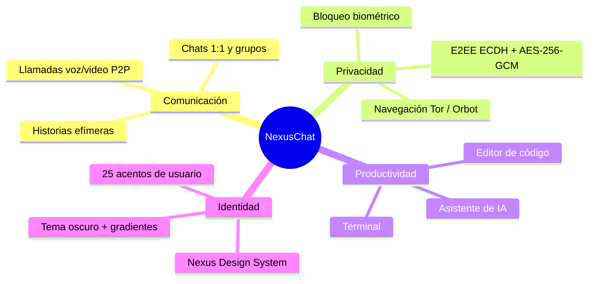
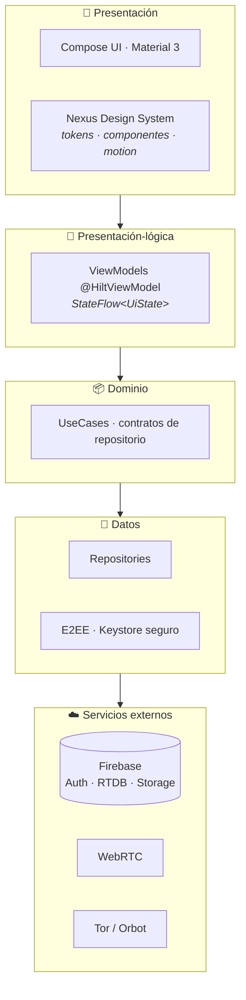
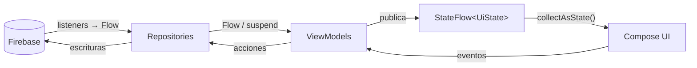
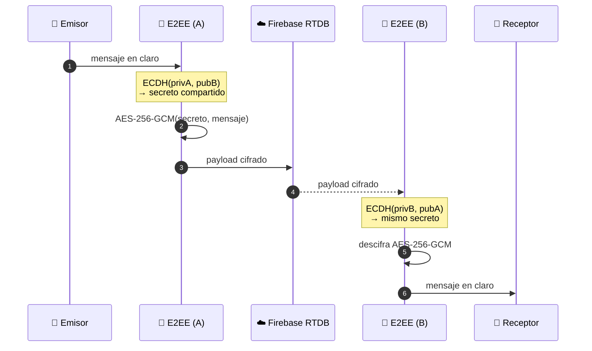
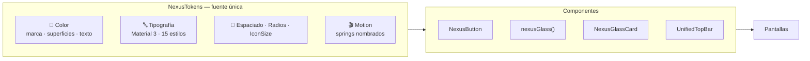
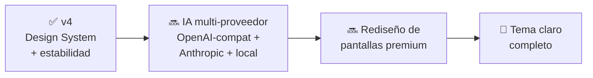

<h1 align="center">NexusChat</h1>

<p align="center">
  
  
  
  
  
  
  
  
</p>

<p align="center">
  <strong>Mensajería en tiempo real con la privacidad como requisito de diseño.</strong><br>
  NexusChat es una aplicación Android nativa de chat con cifrado de extremo a extremo
  (ECDH&nbsp;+&nbsp;AES-256-GCM), llamadas de voz y video P2P, historias efímeras,
  navegación anónima vía Tor y un asistente de IA con proveedor configurable — construida
  íntegramente con <strong>Kotlin</strong> y <strong>Jetpack&nbsp;Compose</strong> sobre un
  Design System propio.
</p>

<!-- TODO: agregar capturas de pantalla (banner o collage principal) -->

---

## Índice

1. [Visión general](#visión-general)
2. [Arquitectura](#arquitectura)
3. [Flujo de un mensaje cifrado](#flujo-de-un-mensaje-cifrado)
4. [Estructura del proyecto](#estructura-del-proyecto)
5. [Funciones](#funciones)
6. [Nexus Design System](#nexus-design-system)
7. [Stack técnico](#stack-técnico)
8. [Seguridad y privacidad](#seguridad-y-privacidad)
9. [Compilar el proyecto](#compilar-el-proyecto)
10. [Roadmap](#roadmap)
11. [Novedades de la v4](#novedades-de-la-v4)
12. [Licencia](#licencia)

---

## Visión general

NexusChat no es un clon de un mensajero existente: combina comunicación en tiempo real
con un conjunto de herramientas de privacidad y productividad poco habituales en el género
—navegador Tor integrado, editor de código, terminal y asistente de IA— bajo una identidad
visual coherente y oscura.



## Arquitectura

NexusChat sigue **MVVM + Repository** con **flujo de datos unidireccional (UDF)**: la
interfaz es una función del estado, y el estado fluye siempre en una sola dirección. Los
datos en tiempo real de Firebase se exponen como `Flow`, los ViewModels los transforman en
un `StateFlow` inmutable, y Compose se recompone automáticamente cuando ese estado cambia.

### Capas



### Ciclo reactivo



Principios que sostienen el diseño:

- **Reactividad:** en un chat los datos cambian solos (mensajes entrantes, presencia,
  typing). No hay "refresh" manual: Firebase notifica, el flujo emite y la UI reacciona.
- **Estado que sobrevive a la UI:** los ViewModels viven más que los Composables, por lo
  que rotar la pantalla o navegar no recarga el chat.
- **Capas reemplazables:** la UI no conoce Firebase; el acceso a datos está encapsulado en
  repositories inyectados con Hilt.

## Flujo de un mensaje cifrado

El servidor **nunca** ve texto plano. El cifrado ocurre en el dispositivo del emisor y solo
el receptor puede descifrar, usando un secreto compartido derivado con ECDH.



## Estructura del proyecto

```
app/src/main/java/com/Azelmods/App/
├── data/              # Capa de datos
│   ├── repository/    #   Repositories (RTDB, Storage, fondos de chat…)
│   ├── model/         #   Modelos (User, Message, Chat…)
│   ├── security/      #   Cifrado E2EE (ECDH + AES-256-GCM) y almacenamiento seguro
│   ├── ai/            #   AiKeyStore (clave de IA cifrada) y cola de peticiones
│   ├── translation/   #   Servicio de traducción de mensajes
│   ├── local/         #   Caché local de mensajes
│   ├── preferences/   #   Preferencias de usuario y tema (DataStore)
│   └── …              #   api, backup, chat, firebase, session, work
├── di/                # Módulos de inyección de dependencias (Hilt)
├── domain/
│   ├── repository/    # Contratos de la capa de dominio
│   └── usecase/       # Casos de uso (cifrado, backups, stories…)
├── security/          # App lock, detección de root/tampering
├── service/           # Servicios en segundo plano (FCM, notificaciones)
├── ui/
│   ├── components/    # Composables reutilizables (NexusButton, NexusGlassCard…)
│   ├── navigation/    # NavGraph y rutas
│   ├── screens/       # Pantallas por feature (chat, home, calls, stories…)
│   └── theme/         # Nexus Design System: tokens, color, tipografía, motion
├── webrtc/            # Motor de llamadas (PeerConnection, cámara, audio)
└── utils/             # Utilidades compartidas
```

## Funciones

### Disponibles hoy

- **Mensajería en tiempo real** — chats 1:1 y grupos sobre Firebase Realtime Database, con
  indicador de escritura, confirmaciones de lectura, respuestas, edición y borrado de
  mensajes, stickers y notas de voz.
- **Cifrado de extremo a extremo (E2EE)** — intercambio de claves **ECDH** por destinatario
  y cifrado autenticado **AES-256-GCM**; el servidor solo almacena el payload cifrado.
- **Llamadas de voz y video (WebRTC)** — audio/video peer-to-peer con señalización vía
  Firebase; el stream viaja directo entre dispositivos.
- **Historias (Stories)** — contenido efímero de 24 horas con reacciones y respuestas.
- **Navegación anónima (Tor/Orbot)** — navegador integrado que enruta el tráfico por la red
  Tor delegando en Orbot como proxy local, con detección de conexión en tiempo real.
- **Asistente de IA** — chat de asistencia con la clave de API del usuario, guardada cifrada
  en el dispositivo (hoy Gemini; ver [Roadmap](#roadmap) para el soporte multi-proveedor).
- **Traducción de mensajes** — traducción on-demand por mensaje con detección de idioma.
- **Editor de código y terminal integrados** — herramientas de desarrollo dentro de la app.
- **Personalización** — 25 acentos de color, fondos de chat (imagen o video), tamaños de
  fuente y modo oscuro.
- **Protección local** — bloqueo biométrico y backups cifrados con AES-256.

<!-- TODO: agregar capturas de pantalla (chat, llamadas, stories, Tor) -->

### En el código, aún no habilitadas

Se mantienen fuera de la interfaz hasta estar completas: Smart Replies, auto-traducción de
chats entrantes, resumen de conversaciones, sugerencias de tono, mejora de fotos y
transcripción de voz.

## Nexus Design System

La identidad visual de NexusChat vive en un Design System propio (`ui/theme/`) que actúa como
**única fuente de verdad**: ninguna pantalla hardcodea colores, tamaños, radios ni tipografías.



Pilares del sistema:

- **Color semántico y accesible** — una sola paleta de marca (violeta `#7C6FE0` → cian),
  con un **test de contraste WCAG** (`NexusPaletteContrastTest`) que rompe la compilación si
  un par texto/superficie deja de cumplir el mínimo legible.
- **Tipografía completa** — los 15 estilos de Material 3 definidos con criterio de pesos
  (SemiBold para énfasis, Normal para lectura); 10–12sp reservado a metadatos.
- **Glassmorphism canónico** — un único modificador `Modifier.nexusGlass()` define la
  superficie de vidrio de la app; los componentes lo consumen en vez de reconstruirla.
- **Motion con propósito** — curvas spring nombradas (`springDefault` / `springBouncy`) que
  las pantallas consumen, en lugar de inventar animaciones locales.
- **Identidad oscura** — fondo oscuro-primero con gradientes de marca, y **25 acentos**
  seleccionables por el usuario, integrados con el `ColorScheme` de Material 3.

> Documentación de diseño completa en [`docs/`](docs/): auditoría, principios y sistema.

## Stack técnico

| Tecnología | Rol | Por qué |
|---|---|---|
| **Kotlin 2.1.20** | Lenguaje | Null-safety, corrutinas y `Flow` nativos: la base de toda la reactividad. |
| **Jetpack Compose (Material 3)** | UI | UI declarativa: la interfaz es una función del estado, sin sincronizar vistas a mano. |
| **Firebase (Auth · RTDB · Storage)** | Backend | Sincronización en tiempo real con listeners push, autenticación y media gestionadas. |
| **Hilt 2.54** | Inyección de dependencias | Grafo validado en compilación e integrado al ciclo de vida (`@HiltViewModel`). |
| **WebRTC** | Llamadas | Estándar abierto para audio/video P2P de baja latencia. |
| **ECDH + AES-256-GCM** | Cifrado | Acuerdo de claves por curva elíptica + cifrado autenticado para el E2EE. |
| **Tor / Orbot · NetCipher** | Anonimato | Enrutado del navegador integrado por la red Tor. |
| **MVVM + Repository** | Arquitectura | Separa UI, estado y datos: cada capa se testea y reemplaza aislada. |
| **minSdk 31 / targetSdk 36** | Compatibilidad | Android 12+ con las APIs modernas de Android 16 (edge-to-edge). |

## Seguridad y privacidad

La privacidad del usuario es un requisito de diseño, no una opción:

- **Cifrado de extremo a extremo:** el contenido se cifra en el dispositivo con **AES-256-GCM**
  usando un secreto derivado por **ECDH** entre emisor y receptor. El backend solo ve datos
  cifrados: ni el servidor ni un tercero con acceso a la base de datos leen las conversaciones.
- **Navegación anónima:** el navegador integrado enruta su tráfico por la red **Tor** (vía
  Orbot), ocultando la IP de origen y dificultando el rastreo de la navegación.
- **Protección local:** bloqueo con biometría, backups cifrados con AES-256 y detección de
  entornos comprometidos (root/tampering).
- **Claves bajo control del usuario:** las credenciales opcionales (como la clave del
  asistente de IA) se guardan cifradas con `EncryptedSharedPreferences` respaldado por el
  Android Keystore, y nunca se envían a servidores propios.

> **Nota responsable:** las funciones de privacidad están pensadas para proteger la
> comunicación legítima. El proyecto no promueve ningún uso contrario a las leyes aplicables.

## Compilar el proyecto

### Requisitos

- **Android Studio** reciente (con soporte para compileSdk 36)
- **JDK 17**
- Dispositivo o emulador con **Android 12 (API 31)** o superior
- Un proyecto de **Firebase** propio

### Pasos

```bash
# 1. Clonar el repositorio
git clone https://github.com/Azelmods677/NexusChat.git
cd NexusChat

# 2. Configurar Firebase
#    - Crear un proyecto en https://console.firebase.google.com
#    - Habilitar Authentication, Realtime Database y Storage
#    - Descargar google-services.json y colocarlo en app/

# 3. Compilar
./gradlew assembleDebug

# 4. Instalar en un dispositivo conectado
./gradlew installDebug
```

Para las llamadas y la mensajería en tiempo real no se necesita ningún servidor adicional:
la señalización y la sincronización usan el proyecto de Firebase configurado. La navegación
Tor requiere tener [Orbot](https://guardianproject.info/apps/org.torproject.android/)
instalado en el dispositivo.

## Roadmap



- **IA multi-proveedor** — cliente compatible con OpenAI que habilita, con la clave del
  usuario, proveedores como OpenAI, **Ollama local**, OpenRouter, NVIDIA, Hugging Face,
  DeepSeek, Mistral y Kimi, además de Anthropic y el Gemini actual.
- **Rediseño de pantallas premium** — aplicar el Nexus Design System pantalla por pantalla.
- **Tema claro completo** — habilitado por la unificación de tokens de la v4.

## Novedades de la v4

- **Nexus Design System** — sistema de color unificado con **design tokens** centralizados y
  test de contraste WCAG, tipografía Material 3 completa, motion y glass canónicos, y el
  nuevo componente `NexusButton`. Los colores dejan de estar dispersos por las pantallas.
- **Compatibilidad Android 16 / edge-to-edge** — corrección de insets (teclado + barras de
  sistema) y de un crash en dispositivos Android&nbsp;&lt;16.
- **Estabilidad** — resuelto el crash al crear una nueva conversación y reforzado el flujo de
  nueva conversación y creación de grupos (navegación y confirmaciones que faltaban).
- **Honestidad de contenido** — tutoriales corregidos para describir el cifrado real
  (ECDH&nbsp;+&nbsp;AES-256-GCM) y el proveedor de IA (Gemini), sin claims inexactos.
- **Limpieza general** — eliminado código y pantallas sin uso; ocultas de la interfaz las
  funciones aún no implementadas, para que lo que la app muestra sea lo que la app hace.

## Licencia

Distribuido bajo licencia **MIT**. Ver [LICENSE](LICENSE) para más detalles.
