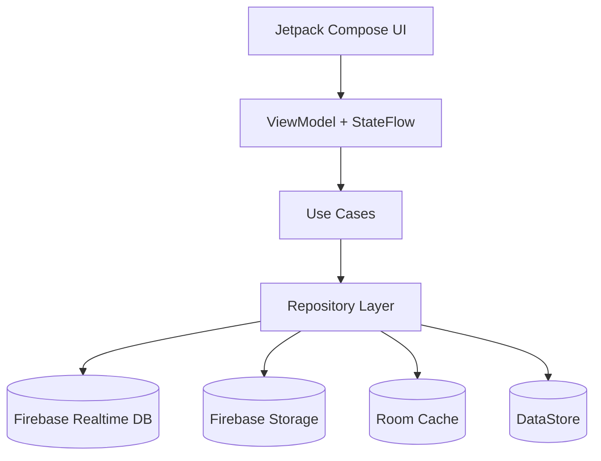
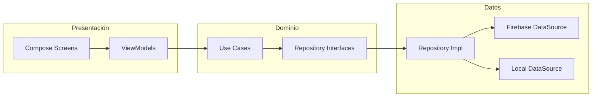
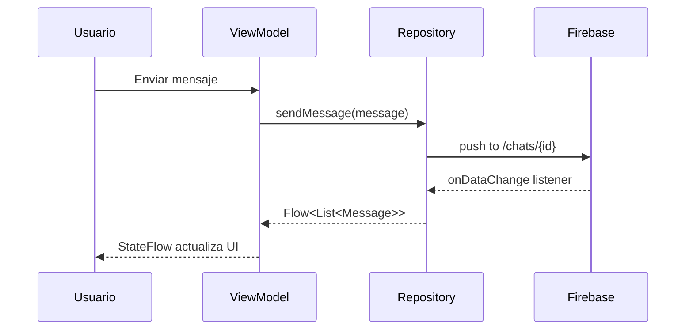
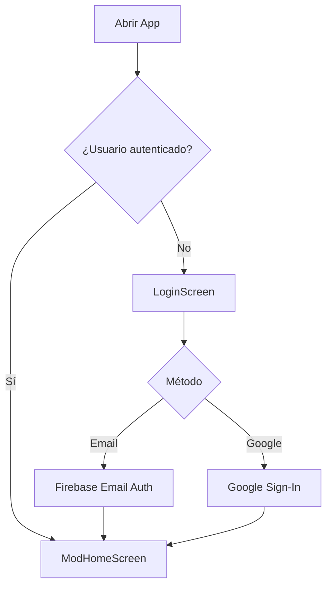

# NexusChat

[](https://www.android.com/)
[](https://kotlinlang.org/)
[](https://developer.android.com/jetpack/compose)
[](https://firebase.google.com/)
[](https://webrtc.org/)
[](LICENSE)

**Aplicación de mensajería moderna para Android construida con Kotlin y Jetpack Compose**

---

## 📖 Descripción General

NexusChat es una aplicación de mensajería instantánea nativa para Android que combina comunicación en tiempo real con una interfaz de usuario moderna y personalizable. Desarrollada completamente en Kotlin utilizando Jetpack Compose, la aplicación implementa Clean Architecture para garantizar escalabilidad, mantenibilidad y separación de responsabilidades.

Diseñada para usuarios que valoran tanto la funcionalidad como la estética, NexusChat ofrece características avanzadas como historias efímeras, llamadas de voz y video mediante WebRTC, un sistema de temas completamente personalizable con 15 opciones predefinidas, y un bot interno con capacidades de automatización. La aplicación utiliza Firebase Realtime Database para sincronización instantánea de mensajes, garantizando una experiencia fluida incluso en condiciones de red variables.

Lo que distingue a NexusChat es su enfoque en la personalización profunda: desde fondos de video por conversación hasta burbujas de mensaje en 3D, pasando por un panel de control estilo mod que proporciona estadísticas en tiempo real y configuraciones avanzadas. La arquitectura modular permite extensibilidad futura mientras mantiene un rendimiento óptimo en dispositivos desde Android 8.0 (API 26) hasta Android 16 (API 36).

---

## ✨ Características

### 💬 Mensajería

- **Chat en tiempo real** con Firebase Realtime Database
- **Mensajes de voz** con visualización de forma de onda animada
- **Compartir multimedia**: imágenes, videos y archivos con compresión automática
- **Indicadores de estado**: ✓ enviado / ✓✓ entregado / ✓✓ azul leído
- **Indicador de escritura** en tiempo real
- **Responder mensajes** deslizando a la derecha
- **Reacciones con emojis** manteniendo pulsado el mensaje
- **Chats grupales** con controles de administrador
- **Mensajes fijados, silenciados y archivados**
- **Búsqueda** de mensajes y conversaciones

### 📖 Historias

- **Caducidad automática** a las 24 horas
- **Barra de progreso** estilo Instagram con animación suave
- **Reacciones y respuestas** rápidas a historias
- **Lista de visualizaciones** con marcas de tiempo
- **Anillos animados**: rojo pulsante para no vistas, gris para vistas
- **Soporte multimedia**: imágenes y videos

### 🎨 Temas y Personalización

- **15 temas de color**: Tóxico, Perverso, Crimson Dark, Neon Red, Blood Moon, Midnight Purple, Ocean Blue, Forest Green, Sunset Orange, Rose Gold, Arctic Ice, Lava, Electric Blue, Golden Hour, Monochrome
- **Burbujas 3D** con efectos de profundidad, sombras y gradientes
- **Fondo de aplicación global**: imagen, video, color sólido o degradado
- **Fondo por chat**: personalizable individualmente para cada conversación
- **Tamaños de fuente ajustables**: Pequeño, Mediano, Grande
- **Navegación por gestos**: deslizar entre pestañas (Chats ↔ Historias ↔ Llamadas ↔ Perfil)
- **Reordenamiento de pestañas** según preferencias del usuario
- **Modo oscuro** optimizado

### 🤖 Bot Interno

- **Respuesta automática** en chats privados con mensajes personalizados
- **Respuesta automática en grupos** con configuración independiente
- **Modo Fantasma**: ocultar última vez, estado en línea y recibos de lectura
- **Mensajes en masa** a múltiples contactos simultáneamente
- **Traductor automático** de entrada de texto
- **Mensajes citados personalizados** con formato especial
- **Mencionar a todos** en grupos con un solo toque
- **Creador de stickers** desde imágenes de la galería

### 📞 Llamadas

- **Llamadas de voz** con WebRTC
- **Videollamadas** con calidad HD
- **Comunicación P2P nativa** con señalización Firebase
- **Calidad adaptativa** según condiciones de red
- **Controles en llamada**: silenciar, altavoz, cambiar cámara
- **Historial de llamadas** con duración y estado

### 🔔 Notificaciones

- **Agrupadas por conversación** para mejor organización
- **Respuesta rápida** desde el panel de notificaciones
- **Marcar como leído** sin abrir la aplicación
- **Avatar del remitente** en cada notificación
- **Firebase Cloud Messaging** para entrega confiable

### ⚙️ Panel Mod

- **Dashboard estilo mod** con interfaz personalizada
- **Estadísticas en vivo**: porcentaje de batería, modelo de dispositivo, reloj en tiempo real
- **Configuraciones avanzadas** agrupadas por categoría (Cuenta, Conversaciones, Privacidad, Avatar, Notificaciones, Almacenamiento, Ayuda, Invitar)
- **Pantalla About** con información del mod, versión y enlaces sociales
- **Gestión de funciones** con interruptores visuales
- **Sistema de tutoriales** integrado (8 guías completas)

---

## 🏗️ Arquitectura

### Diagrama General



### Diagrama de Capas Clean Architecture



### Flujo de Mensajes en Tiempo Real



### Flujo de Autenticación



---

## 🛠️ Stack Tecnológico

| Capa | Tecnología | Versión |
|------|-----------|---------|
| **UI** | Jetpack Compose BOM | 2025.04.01 |
| **Lenguaje** | Kotlin | 100% |
| **Arquitectura** | Clean Architecture + MVVM | — |
| **Base de datos** | Firebase Realtime Database | BOM 33.7.0 |
| **Almacenamiento** | Firebase Storage | BOM 33.7.0 |
| **Autenticación** | Firebase Auth | BOM 33.7.0 |
| **Mensajería push** | Firebase Cloud Messaging | BOM 33.7.0 |
| **Inyección de dependencias** | Hilt | 2.52 |
| **Carga de imágenes** | Coil | 3.1.0 |
| **Reproductor de video** | ExoPlayer media3 | 1.3.1 |
| **Llamadas** | Stream WebRTC Android | 1.1.3 |
| **Caché local** | Room | — |
| **Preferencias** | DataStore | — |
| **Corrutinas** | Kotlin Coroutines + Flow | 1.9.0 |
| **SDK mínimo** | Android 8.0 (Oreo) | API 26 |
| **SDK objetivo** | Android 16 | API 36 |

---

## 📂 Estructura del Proyecto

```
app/src/main/java/com/Azelmods/App/
│
├── data/                           # Capa de Datos
│   ├── repository/                 # Implementaciones de repositorios
│   │   ├── ChatRepository.kt
│   │   ├── UserRepository.kt
│   │   ├── StoryRepository.kt
│   │   ├── CallRepository.kt
│   │   ├── ChatBackgroundRepository.kt
│   │   ├── GroupRepository.kt
│   │   └── InternalBotRepository.kt
│   │
│   ├── remote/                     # Fuentes de datos remotas
│   │   └── FirebaseDataSource.kt
│   │
│   ├── local/                      # Fuentes de datos locales
│   │   ├── RoomDatabase.kt
│   │   └── DataStoreManager.kt
│   │
│   ├── preferences/                # Preferencias con DataStore
│   │   ├── ThemePreferences.kt
│   │   └── BotPreferences.kt
│   │
│   ├── manager/                    # Gestores de funcionalidades
│   │   └── AppBackgroundManager.kt
│   │
│   └── model/                      # Modelos de datos
│       ├── User.kt
│       ├── Message.kt
│       ├── Story.kt
│       ├── Call.kt
│       └── BackgroundConfig.kt
│
├── domain/                         # Capa de Dominio
│   ├── model/                      # Modelos de dominio
│   │
│   ├── repository/                 # Interfaces de repositorios
│   │   ├── IChatRepository.kt
│   │   ├── IUserRepository.kt
│   │   └── IStoryRepository.kt
│   │
│   └── usecase/                    # Casos de uso (lógica de negocio)
│       ├── SendMessageUseCase.kt
│       ├── CreateStoryUseCase.kt
│       ├── StartCallUseCase.kt
│       ├── SendFileUseCase.kt
│       ├── ArchiveChatUseCase.kt
│       ├── PinChatUseCase.kt
│       └── MuteChatUseCase.kt
│
├── ui/                             # Capa de Presentación
│   ├── screens/                    # Pantallas Compose
│   │   ├── chat/
│   │   │   ├── ChatScreen.kt
│   │   │   ├── ChatViewModel.kt
│   │   │   └── MediaGalleryScreen.kt
│   │   │
│   │   ├── stories/
│   │   │   ├── StoriesScreen.kt
│   │   │   ├── StoriesViewModel.kt
│   │   │   ├── StoryViewerScreen.kt
│   │   │   └── StoryViewerViewModel.kt
│   │   │
│   │   ├── profile/
│   │   │   ├── ProfileScreen.kt
│   │   │   ├── ProfileViewModel.kt
│   │   │   └── EditProfileScreen.kt
│   │   │
│   │   ├── calls/
│   │   │   ├── CallsScreen.kt
│   │   │   ├── ActiveCallScreen.kt
│   │   │   └── IncomingCallScreen.kt
│   │   │
│   │   ├── home/
│   │   │   ├── HomeScreen.kt
│   │   │   ├── ModHomeScreen.kt
│   │   │   ├── ChatListScreen.kt
│   │   │   └── NewConversationScreen.kt
│   │   │
│   │   ├── settings/
│   │   │   ├── SettingsScreen.kt
│   │   │   ├── ModSettingsScreen.kt
│   │   │   ├── ModFunctionsScreen.kt
│   │   │   ├── ModAboutScreen.kt
│   │   │   ├── ThemeCustomizationScreen.kt
│   │   │   ├── PrivacySecurityScreen.kt
│   │   │   └── NotificationsScreen.kt
│   │   │
│   │   ├── bot/
│   │   │   └── InternalBotScreen.kt
│   │   │
│   │   ├── background/
│   │   │   └── BackgroundPickerScreen.kt
│   │   │
│   │   └── viewer/
│   │       └── PhotoViewerScreen.kt
│   │
│   ├── components/                 # Componentes reutilizables
│   │   ├── AppBackground.kt
│   │   ├── VideoBackgroundPlayer.kt
│   │   ├── VideoWallpaper.kt
│   │   ├── VoiceRecorder.kt
│   │   └── ColorPickerDialog.kt
│   │
│   ├── theme/                      # Configuración de tema
│   │   ├── Theme.kt
│   │   ├── Color.kt
│   │   └── Type.kt
│   │
│   └── navigation/                 # Navegación
│       ├── NavGraph.kt
│       └── Screen.kt
│
├── di/                             # Inyección de Dependencias (Hilt)
│   ├── AppModule.kt
│   ├── RepositoryModule.kt
│   ├── NetworkModule.kt
│   └── SecurityModule.kt
│
├── services/                       # Servicios de Android
│   ├── CallService.kt
│   ├── NexusFirebaseMessagingService.kt
│   └── NotificationService.kt
│
└── MainActivity.kt                 # Punto de entrada
```

---

## 🚀 Configuración e Instalación

### Requisitos Previos

- **Android Studio** Hedgehog (2023.1.1) o superior
- **JDK** 17 o superior
- **Android SDK** API 36
- **Cuenta de Firebase** (gratuita)

### Clonar y Compilar

```bash
# Clonar el repositorio
git clone https://github.com/AzelMods677/NexusChat.git
cd NexusChat

# Compilar APK de depuración
./gradlew assembleDebug

# Instalar en dispositivo conectado
./gradlew installDebug

# Compilar APK de lanzamiento (requiere configuración de firma)
./gradlew assembleRelease
```

**Salida**: `app/build/outputs/apk/debug/app-debug.apk`

---

## 🔥 Configuración de Firebase

### Paso 1: Crear Proyecto en Firebase

1. Accede a [Firebase Console](https://console.firebase.google.com)
2. Haz clic en "Agregar proyecto" y sigue el asistente
3. Agrega una aplicación Android a tu proyecto:
   - **Nombre del paquete**: `com.Azelmods.App`
   - Descarga el archivo `google-services.json`
   - Colócalo en el directorio `app/`

### Paso 2: Habilitar Servicios de Firebase

Activa los siguientes servicios en Firebase Console:

- **Realtime Database** (Modo de prueba o producción)
- **Storage** (Modo de prueba o producción)
- **Authentication** (Habilita Email/Contraseña y Google Sign-In)
- **Cloud Messaging** (Se habilita automáticamente)

### Paso 3: Configurar Reglas de Base de Datos

Ve a **Realtime Database → Reglas** y configura:

```json
{
  "rules": {
    ".read": "auth != null",
    ".write": "auth != null",
    "users": {
      "$uid": {
        ".read": "auth != null",
        ".write": "auth.uid === $uid"
      }
    },
    "chats": {
      "$chatId": {
        ".read": "auth != null && (data.child('participants').child(auth.uid).exists() || !data.exists())",
        ".write": "auth != null && (data.child('participants').child(auth.uid).exists() || !data.exists())"
      }
    },
    "messages": {
      "$chatId": {
        ".read": "auth != null",
        ".write": "auth != null"
      }
    },
    "stories": {
      ".read": "auth != null",
      "$storyId": {
        ".write": "auth != null && (!data.exists() || data.child('userId').val() === auth.uid)"
      }
    },
    "calls": {
      "$callId": {
        ".read": "auth != null",
        ".write": "auth != null"
      }
    }
  }
}
```

### Paso 4: Configurar Reglas de Storage

Ve a **Storage → Reglas** y configura:

```
rules_version = '2';
service firebase.storage {
  match /b/{bucket}/o {
    match /{allPaths=**} {
      // Permitir lectura a usuarios autenticados
      allow read: if request.auth != null;
      
      // Permitir escritura con límite de tamaño (10 MB)
      allow write: if request.auth != null 
                   && request.resource.size < 10 * 1024 * 1024;
    }
    
    // Reglas específicas para perfiles
    match /profile_images/{userId}/{fileName} {
      allow read: if request.auth != null;
      allow write: if request.auth != null 
                   && request.auth.uid == userId
                   && request.resource.size < 5 * 1024 * 1024;
    }
    
    // Reglas específicas para historias
    match /stories/{userId}/{storyId} {
      allow read: if request.auth != null;
      allow write: if request.auth != null 
                   && request.auth.uid == userId
                   && request.resource.size < 10 * 1024 * 1024;
    }
  }
}
```

### Paso 5: Configurar Google Sign-In

1. Ve a **Authentication → Método de inicio de sesión**
2. Habilita el proveedor **Google**
3. Agrega tu huella digital SHA-1:
   ```bash
   keytool -list -v -keystore ~/.android/debug.keystore -alias androiddebugkey -storepass android -keypass android
   ```
4. Descarga el archivo `google-services.json` actualizado y reemplázalo en `app/`

---

## 📝 Registro de Cambios

### v2.0.0 — 2026

- ✨ **Rediseño completo de UI** con interfaz estilo mod
- 🎨 **15 temas personalizados** con selector de color de acento
- 🎥 **Fondos de video** por chat y globales
- 🎤 **Mensajes de voz** con visualización de forma de onda
- 🤖 **Sistema de bot interno** (respuesta automática, modo fantasma, mensajes en masa)
- 🖼️ **Selector de fondos** con galería, colores sólidos y degradados
- 📸 **Visor de fotos** con zoom (1x-4x)
- ✂️ **Recorte de imágenes** con posicionamiento
- 👆 **Navegación por gestos** (deslizar entre pestañas)
- 📚 **Sistema de tutoriales** integrado (8 guías completas)
- 🔧 **Tamaños de fuente ajustables** (Pequeño, Mediano, Grande)
- 🐛 **Corrección de navegación de historias** con codificación URL
- 🐛 **Corrección de integración de Google Sign-In**
- 🐛 **Eliminación de colores hardcodeados** en toda la aplicación
- ⚡ **Mejoras de rendimiento** y optimización de memoria
- 🔒 **Mejoras de seguridad** en autenticación y almacenamiento

### v1.0.0 — 2025

- 🎉 **Lanzamiento inicial**
- 💬 **Mensajería en tiempo real** con Firebase
- 📖 **Historias** con caducidad de 24 horas
- 📞 **Llamadas de voz y video** con WebRTC
- 🔐 **Autenticación Firebase** (Email + Google)
- 🔔 **Notificaciones push** con FCM
- 🎨 **Material Design 3** con modo oscuro
- 👥 **Chats grupales** con gestión de miembros
- 🔍 **Búsqueda** de mensajes y conversaciones

---

## 🤝 Contribuir

¡Las contribuciones son bienvenidas! Si deseas contribuir a NexusChat, sigue estos pasos:

1. **Fork** el proyecto
2. Crea una rama para tu funcionalidad (`git checkout -b feature/NuevaFuncionalidad`)
3. Realiza tus cambios y haz commit (`git commit -m 'Agregar nueva funcionalidad'`)
4. Sube los cambios a tu fork (`git push origin feature/NuevaFuncionalidad`)
5. Abre un **Pull Request** describiendo tus cambios

### Guías de Contribución

- Escribe código en **Kotlin 100%**
- Sigue los principios de **Clean Architecture**
- Usa **Jetpack Compose** para toda la UI
- Escribe **tests unitarios** cuando sea posible
- Documenta funciones públicas con **KDoc**
- Respeta las convenciones de código del proyecto
- Asegúrate de que el código compile sin errores antes de hacer commit

---

## 📄 Licencia

```
MIT License

Copyright (c) 2026 AzelMods677

Se concede permiso, de forma gratuita, a cualquier persona que obtenga una copia
de este software y de los archivos de documentación asociados (el "Software"),
para utilizar el Software sin restricción, incluyendo sin limitación los derechos
a usar, copiar, modificar, fusionar, publicar, distribuir, sublicenciar y/o vender
copias del Software, y a permitir a las personas a las que se les proporcione el
Software a hacer lo mismo, sujeto a las siguientes condiciones:

El aviso de copyright anterior y este aviso de permiso se incluirán en todas las
copias o partes sustanciales del Software.

EL SOFTWARE SE PROPORCIONA "TAL CUAL", SIN GARANTÍA DE NINGÚN TIPO, EXPRESA O
IMPLÍCITA, INCLUYENDO PERO NO LIMITADO A GARANTÍAS DE COMERCIALIZACIÓN, IDONEIDAD
PARA UN PROPÓSITO PARTICULAR Y NO INFRACCIÓN. EN NINGÚN CASO LOS AUTORES O
TITULARES DEL COPYRIGHT SERÁN RESPONSABLES DE NINGUNA RECLAMACIÓN, DAÑOS U OTRAS
RESPONSABILIDADES, YA SEA EN UNA ACCIÓN DE CONTRATO, AGRAVIO O CUALQUIER OTRO
MOTIVO, QUE SURJA DE O EN CONEXIÓN CON EL SOFTWARE O EL USO U OTROS TRATOS EN EL
SOFTWARE.
```

---

## 📞 Contacto

- **YouTube**: [@AzelModsx677](https://www.youtube.com/@AzelModsx677)
- **TikTok**: [@azelmodsx677](https://www.tiktok.com/@azelmodsx677)
- **Telegram**: [@AzelModsx67779](https://t.me/AzelModsx67779)

---

<div align="center">

⭐ **¡Si te gusta este proyecto, dale una estrella!** ⭐

Hecho con ❤️ por [AzelMods677](https://github.com/AzelMods677)

© 2026 AzelMods677. Todos los derechos reservados.

</div>
