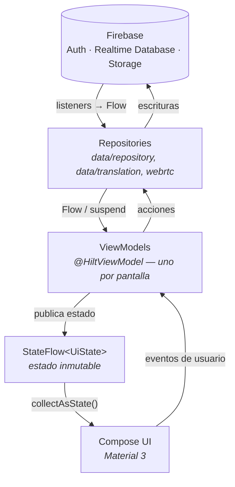

<h1 align="center">NexusChat</h1>

<p align="center">
  
  
  
  
  
  
</p>

<p align="center">
  <strong>Mensajería en tiempo real con privacidad como prioridad.</strong><br>
  NexusChat es una aplicación Android nativa de chat con cifrado de extremo a extremo,
  llamadas de voz y video P2P, historias efímeras y navegación anónima vía Tor,
  construida íntegramente con Kotlin y Jetpack Compose.
</p>

<!-- TODO: agregar capturas de pantalla (banner o collage principal) -->

---

## Índice

1. [Arquitectura](#arquitectura)
2. [Estructura del proyecto](#estructura-del-proyecto)
3. [Funciones](#funciones)
4. [Stack técnico](#stack-técnico)
5. [Novedades de la v4](#novedades-de-la-v4)
6. [Seguridad y privacidad](#seguridad-y-privacidad)
7. [Compilar el proyecto](#compilar-el-proyecto)
8. [Licencia](#licencia)

---

## Arquitectura

NexusChat sigue **MVVM + Repository** con flujo de datos unidireccional (UDF):
la interfaz es una función del estado, y el estado fluye siempre en una sola
dirección. Los datos en tiempo real de Firebase se exponen como `Flow`, los
ViewModels los transforman en un `StateFlow` de estado inmutable, y Compose
se recompone automáticamente cuando ese estado cambia.



Principios que sostienen el diseño:

- **Reactividad:** en un chat los datos cambian solos (mensajes entrantes,
  presencia, typing). No hay "refresh" manual: Firebase notifica, el flujo
  emite y la UI reacciona.
- **Estado que sobrevive a la UI:** los ViewModels viven más que los
  Composables, por lo que rotar la pantalla o navegar no recarga el chat.
- **Capas reemplazables:** la UI no conoce Firebase; el acceso a datos está
  encapsulado en repositories inyectados con Hilt.

## Estructura del proyecto

```
app/src/main/java/com/Azelmods/App/
├── data/              # Capa de datos
│   ├── repository/    #   Repositories (RTDB, Storage, fondos de chat…)
│   ├── model/         #   Modelos (User, Message, Chat…)
│   ├── security/      #   Cifrado E2EE y almacenamiento seguro
│   ├── translation/   #   Servicio de traducción de mensajes
│   ├── local/         #   Caché local de mensajes
│   ├── preferences/   #   Preferencias de usuario y tema (DataStore)
│   └── …              #   api, backup, chat, firebase, session, work
├── di/                # Módulos de inyección de dependencias (Hilt)
├── domain/
│   ├── repository/    # Contratos de la capa de dominio
│   └── usecase/       # Casos de uso (cifrado, backups, stories…)
├── security/          # App lock, detección de root/tampering
├── service/           # Servicios en segundo plano (FCM, notificaciones)
├── ui/
│   ├── components/    # Composables reutilizables
│   ├── navigation/    # NavGraph y rutas
│   ├── screens/       # Pantallas por feature (chat, home, calls, stories…)
│   └── theme/         # Design tokens, esquemas de color, tipografía
├── webrtc/            # Motor de llamadas (PeerConnection, cámara, audio)
└── utils/             # Utilidades compartidas
```

## Funciones

### Disponibles hoy

- **Mensajería en tiempo real** — chats 1:1 y grupos sobre Firebase Realtime
  Database, con indicador de escritura, confirmaciones de lectura, respuestas,
  edición y borrado de mensajes, stickers y notas de voz.
- **Cifrado de extremo a extremo (E2EE)** — los mensajes se cifran en el
  dispositivo del emisor y solo el receptor puede leerlos; el servidor solo
  almacena el payload cifrado.
- **Llamadas de voz y video (WebRTC)** — audio/video peer-to-peer con
  señalización vía Firebase; el stream viaja directo entre dispositivos.
- **Historias (Stories)** — contenido efímero de 24 horas con reacciones y
  respuestas directas.
- **Navegación anónima (Tor/Orbot)** — navegador integrado que enruta el
  tráfico por la red Tor delegando en Orbot como proxy local.
- **Traducción de mensajes** — traducción on-demand por mensaje con detección
  de idioma y avisos de límites de uso.
- **Editor de código integrado** — editor con resaltado de sintaxis para
  revisar y editar archivos de código desde la app.
- **Terminal integrada** — consola para ejecutar comandos dentro del entorno
  de la app.
- **Asistente de IA opcional** — chat de asistencia con clave de API provista
  por el usuario, almacenada cifrada en el dispositivo.
- **Personalización** — temas con múltiples colores de acento, fondos de chat
  (imagen o video), tamaños de fuente y modo oscuro.
- **Protección local** — bloqueo biométrico y backups cifrados.

<!-- TODO: agregar capturas de pantalla (chat, llamadas, stories, Tor) -->

### Próximamente

Funciones presentes en el código pero aún no habilitadas al usuario. Se
mantienen fuera de la interfaz hasta que estén completas:

- **Smart Replies** — respuestas rápidas sugeridas por IA.
- **Auto-traducción de mensajes entrantes** — traducción automática del chat
  completo (hoy la traducción es manual, por mensaje).
- **Resumen de conversaciones, sugerencias de tono, mejora de fotos y
  transcripción de voz** — asistencias de IA sobre el contenido del chat.

## Stack técnico

| Tecnología | Rol | Por qué |
|---|---|---|
| **Kotlin 2.0.21** | Lenguaje | Null-safety, corrutinas y `Flow` nativos: la base de toda la reactividad de la app. |
| **Jetpack Compose (Material 3)** | UI | UI declarativa: la interfaz es una función del estado, sin sincronización manual de vistas. |
| **Firebase (Auth · RTDB · Storage)** | Backend | Sincronización en tiempo real con listeners push, autenticación y almacenamiento de media gestionados. |
| **Hilt** | Inyección de dependencias | Grafo de dependencias validado en compilación e integrado al ciclo de vida Android (`@HiltViewModel`). |
| **MVVM + Repository** | Arquitectura | Separa UI, estado y datos: cada capa se puede testear y reemplazar de forma aislada. |
| **WebRTC** | Llamadas | Estándar abierto para audio/video P2P de baja latencia. |
| **minSdk 31 / targetSdk 36** | Compatibilidad | Cubre Android 12+ manteniendo acceso a las APIs modernas de Android 16. |

## Novedades de la v4

La versión 4 se centró en madurar el proyecto: menos superficie, más solidez.

- **Estabilidad** — se resolvió el crash al crear una nueva conversación
  (colisión de claves en listas con datos duplicados) y se reforzó el flujo
  completo de nueva conversación y creación de grupos, incluyendo la
  navegación y confirmaciones al usuario que antes faltaban.
- **Arquitectura visual** — el sistema de colores se unificó con **design
  tokens** centralizados: los colores dejan de estar dispersos por las
  pantallas y pasan a definirse una sola vez, lo que garantiza consistencia
  visual y deja el terreno preparado para un tema claro completo.
- **Limpieza general** — se eliminaron pantallas duplicadas y código sin uso,
  se recortó documentación interna de funciones que ya no existen y se
  ocultaron de la interfaz las funciones aún no implementadas, para que lo
  que la app muestra sea exactamente lo que la app hace.
- **Traducción más transparente** — el traductor ahora informa sus límites
  (cuota diaria del servicio gratuito y truncado de mensajes largos) en lugar
  de fallar o recortar en silencio.

## Seguridad y privacidad

La privacidad del usuario es un requisito de diseño, no una opción:

- **Cifrado de extremo a extremo:** el contenido de los mensajes se cifra en
  el dispositivo antes de salir. El backend solo ve datos cifrados: ni el
  servidor ni un tercero con acceso a la base de datos pueden leer las
  conversaciones.
- **Navegación anónima:** el navegador integrado puede enrutar todo su
  tráfico a través de la red Tor (vía Orbot), ocultando la dirección IP de
  origen y dificultando el rastreo de la actividad de navegación.
- **Protección local:** bloqueo de la app con biometría, backups cifrados con
  AES-256 y detección de entornos comprometidos (root/tampering).
- **Claves bajo control del usuario:** las credenciales opcionales (como la
  clave del asistente de IA) se guardan cifradas en el dispositivo y nunca se
  envían a servidores propios.

> Nota responsable: las funciones de privacidad están pensadas para proteger
> la comunicación legítima de los usuarios. El proyecto no promueve ningún
> uso contrario a las leyes aplicables.

## Compilar el proyecto

### Requisitos

- **Android Studio** (versión reciente con soporte para compileSdk 36)
- **JDK 17**
- Un dispositivo o emulador con **Android 12 (API 31)** o superior
- Un proyecto de **Firebase** propio

### Pasos

```bash
# 1. Clonar el repositorio
git clone https://github.com/Azelmods677/NexusChat.git
cd NexusChat

# 2. Configurar Firebase
#    - Crear un proyecto en https://console.firebase.google.com
#    - Habilitar Authentication, Realtime Database y Storage
#    - Descargar google-services.json y colocarlo en app/

# 3. Compilar
./gradlew assembleDebug

# 4. Instalar en un dispositivo conectado
./gradlew installDebug
```

Para las llamadas y la mensajería en tiempo real no se necesita ningún
servidor adicional: la señalización y la sincronización usan el proyecto de
Firebase configurado. La navegación Tor requiere tener
[Orbot](https://guardianproject.info/apps/org.torproject.android/) instalado
en el dispositivo.

## Licencia

Distribuido bajo licencia **MIT**. Ver [LICENSE](LICENSE) para más detalles.
