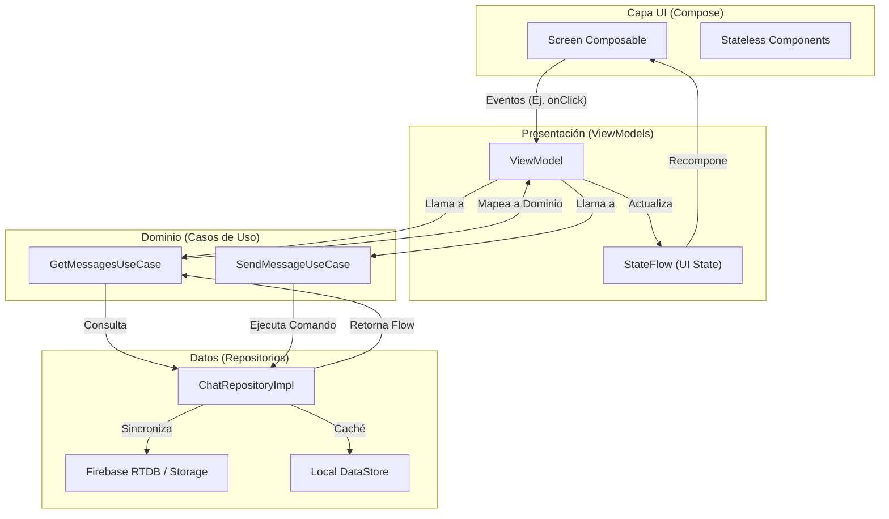
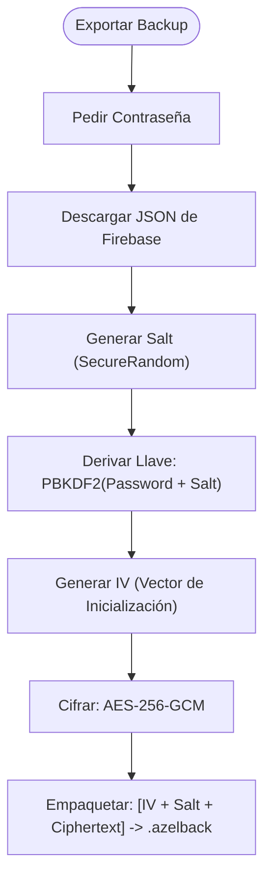

<p align="center">


  

  
</p>

<h1 align="center">Nexus Chat (Enterprise Template para Devs)</h1>

<p align="center">
  <strong>Arquitectura de Referencia y Plantilla Profesional de Mensajería para Desarrolladores Android.</strong><br>
  Una inmersión profunda en Jetpack Compose, Firebase RTDB, Clean Architecture Avanzada, Criptografía Local y Google Gemini AI.
</p>

<p align="center">
  
  
  
  
  
  
  
  
</p>

---

## 📖 Índice Exhaustivo
1. [Visión General del Proyecto](#-visión-general-del-proyecto)
2. [Novedades en v4.0.0](#-novedades-en-v400)
3. [Arquitectura e Ingeniería de Software](#-arquitectura-e-ingeniería-de-software)
   - [Unidirectional Data Flow (UDF)](#unidirectional-data-flow-udf)
   - [Inyección de Dependencias (Hilt)](#inyección-de-dependencias-hilt)
4. [Módulo de Mensajería y Tiempo Real](#-módulo-de-mensajería-y-tiempo-real)
   - [Firebase Realtime Database (RTDB)](#firebase-realtime-database-rtdb)
   - [Traducción Automática (MyMemory API)](#traducción-automática-mymemory-api)
5. [Seguridad Criptográfica y Privacidad](#-seguridad-criptográfica-y-privacidad)
   - [Pipeline de Backups (.azelback)](#pipeline-de-backups-azelback)
   - [Biometría y App Lock](#biometría-y-app-lock)
   - [Enrutamiento Anónimo (Tor/Orbot)](#enrutamiento-anónimo-tororbot)
6. [Motor de Inteligencia Artificial (Azel AI)](#-motor-de-inteligencia-artificial-azel-ai)
   - [Ingeniería de Prompts y Bypass Levels](#ingeniería-de-prompts-y-bypass-levels)
   - [Streaming (Server-Sent Events)](#streaming-server-sent-events)
7. [Ecosistema para Desarrolladores](#-ecosistema-para-desarrolladores)
   - [Sora Code Editor Integrado](#sora-code-editor-integrado)
   - [AndroidBridge JS Evaluator](#androidbridge-js-evaluator)
8. [Telecomunicaciones (WebRTC)](#-telecomunicaciones-webrtc)
9. [Estructura de Carpetas](#-estructura-de-carpetas)
10. [Instalación y Despliegue](#-instalación-y-despliegue)
11. [Stack Tecnológico Detallado](#-stack-tecnológico-detallado)

---

## 🚀 Visión General del Proyecto

**Nexus Chat** no es un clon de chat ordinario; es una obra maestra de ingeniería Android diseñada para servir como un **portafolio definitivo** y una **arquitectura de referencia (Template)** para aplicaciones a gran escala. 

El repositorio demuestra cómo resolver problemas complejos de concurrencia, estado de UI, criptografía, comunicación P2P, y manipulación de WebViews, empujando los límites de lo que una aplicación Android nativa puede lograr en un entorno de alta seguridad.

---

## 🎉 Novedades en v4.0.0

La versión 4.0.0 representa un hito de estabilidad y robustez con correcciones críticas que mejoran la experiencia del usuario y la confiabilidad del sistema.

### 🐛 Correcciones de Bugs Críticos

#### 1. **Fix: LazyColumn Duplicate Key Crash (Critical)**
- **Problema**: La app crasheaba con `IllegalArgumentException: Key "" was already used` cuando mensajes tenían `messageId` vacíos o fallback keys duplicados
- **Solución**: Migrado de `items()` a `itemsIndexed()` con sistema de clave basada en hash de contenido
- **Impacto**: Eliminación total de crashes en scroll de chat con mensajes duplicados
- **Archivos**: `ChatScreen.kt`, `Message.kt`

#### 2. **Fix: Firebase Storage Permission Denied (High)**
- **Problema**: Error "Permission denied" al subir imágenes debido a falta de validación de autenticación
- **Solución**: Añadida verificación de `FirebaseAuth.currentUser` en los 8 métodos de upload (imágenes, audio, video, documentos, stories)
- **Impacto**: Prevención de errores de permisos y mejor feedback al usuario
- **Archivos**: `StorageRepository.kt`

#### 3. **Fix: Translation Service Error Handling (Medium)**
- **Problema**: Manejo deficiente de errores en el servicio de traducción sin feedback claro
- **Solución**: Añadido manejo exhaustivo de `JSONException` e `IOException`, validación de respuestas API y logging detallado
- **Impacto**: Mejor experiencia de usuario con mensajes de error claros
- **Archivos**: `TranslationService.kt`

#### 4. **Fix: Code Editor File Creation Failures (Medium)**
- **Problema**: El editor de código no mostraba errores cuando fallaba la creación/guardado de archivos
- **Solución**: Añadida validación de autenticación, validación de nombres de archivo, generación de ID fallback y mensajes de error en UI
- **Impacto**: Usuarios ahora reciben feedback claro cuando la creación de archivos falla
- **Archivos**: `CodeEditorViewModel.kt`

#### 5. **Fix: False Offline Mode with Active WiFi (Medium)**
- **Problema**: Mensajes mostraban "guardado esperando conexión" incluso con WiFi activo
- **Solución**: Implementada detección específica de tipos de error (red vs auth vs Firebase), solo activa modo offline con errores reales de red
- **Impacto**: Modo offline solo se activa con problemas reales de conectividad
- **Archivos**: `ChatViewModel.kt`, `RealtimeDatabaseRepository.kt`

### 📊 Estadísticas de la Versión
- **5 bugs críticos y de alta prioridad resueltos**
- **4 archivos core mejorados** con mejor manejo de errores
- **Estabilidad mejorada** en componentes de mensajería, storage y editor
- **Experiencia de usuario refinada** con feedback claro en operaciones

---

## 🏗️ Arquitectura e Ingeniería de Software

La aplicación se adhiere estrictamente a los principios SOLID y a una variante moderna de **Clean Architecture** recomendada por Google. 

### Unidirectional Data Flow (UDF)
Toda la interfaz de usuario de Jetpack Compose está impulsada por el flujo unidireccional de datos. Los eventos del usuario (Intents) suben hacia el `ViewModel`, y el estado (State) fluye hacia abajo hacia las funciones Composables.



### Inyección de Dependencias (Hilt)
Utilizamos **Dagger Hilt** para inyectar repositorios, servicios y utilidades a lo largo del ciclo de vida de la app. Esto asegura que componentes como `TranslationService` o `ProxyManager` sean *Singletons* y no causen fugas de memoria, mientras que los `ViewModels` mantienen un ciclo de vida atado a la navegación.

---

## 💬 Módulo de Mensajería y Tiempo Real

### Firebase Realtime Database (RTDB)
En lugar de una base de datos relacional tradicional (SQL), Nexus Chat emplea Firebase RTDB. Esto permite mantener conexiones WebSocket abiertas con el servidor. Cuando un nodo cambia, los `ValueEventListener` de Firebase actualizan un `kotlinx.coroutines.flow.Flow` en tiempo real, desencadenando una recomposición instantánea en Jetpack Compose con latencia de milisegundos.

### Traducción Automática (MyMemory API)
Hemos integrado un traductor nativo en la burbuja del chat. El servicio `TranslationService.kt`:
1.  Utiliza una heurística de análisis de caracteres (`Regex`) para la **detección del idioma** de origen en caso de que la API falle.
2.  Despacha la petición HTTP a través de `Dispatchers.IO` para evitar saturar el Main Thread (UI).
3.  Actualiza discretamente el nodo de Firebase para que ambos usuarios vean el mensaje traducido sin recargar la pantalla.

```mermaid
sequenceDiagram
    participant Usuario
    participant UI as Pantalla Chat
    participant VM as ChatViewModel
    participant FB as Firebase RTDB
    participant API as MyMemory API

    Usuario->>UI: Long-press -> "Traducir"
    UI->>VM: requestTranslation(msgId)
    VM->>UI: Emite State(Cargando = true)
    
    rect rgb(30, 30, 46)
        Note right of VM: Despacho asíncrono (Dispatchers.IO)
        VM->>API: HTTP GET /translate (Petición)
        API-->>VM: JSON Response (Texto Traducido)
    end
    
    VM->>FB: updateChildren(translatedNode)
    FB-->>VM: Confirmación
    VM->>UI: Emite State(Cargando = false)
```



---

## 🛡️ Seguridad Criptográfica y Privacidad

La privacidad no es una sugerencia en Nexus Chat; es la columna vertebral de la aplicación.

### Pipeline de Backups (.azelback)
Las copias de seguridad de los historiales de chat no se suben en texto plano. Hemos implementado un sistema criptográfico de nivel militar:
1.  **Derivación de Claves:** Usamos `SecretKeyFactory` con el algoritmo `PBKDF2WithHmacSHA1`. Unimos la contraseña del usuario con un Salt aleatorio y ejecutamos iteraciones criptográficas para generar un hash invulnerable a ataques de diccionario rápido.
2.  **Cifrado:** Usamos `Cipher` de Java Cryptography Extension con `AES/GCM/NoPadding`. Este modo proporciona confidencialidad y autenticidad (AEAD), asegurando que el backup no ha sido alterado (tampering).



### Biometría y App Lock
El acceso a la app se protege usando `BiometricPrompt` nativo de AndroidX. Si falla, cae a un sistema de validación de PIN seguro respaldado por Jetpack DataStore (que cifra los valores usando `EncryptedSharedPreferences` y el `MasterKey` del Keystore de Android).

### Enrutamiento Anónimo (Tor/Orbot)
Para combatir la vigilancia de la red (Clearnet), Nexus incorpora un navegador interno. 
El `ProxyManager.kt` configura el proxy a nivel de sistema web (Webkit API) para rutear todas las conexiones del `WebView` a través del demonio Tor local (Orbot) en el puerto `127.0.0.1:9050`. Permite acceder nativamente a dominios `.onion`.

---

## 🤖 Motor de Inteligencia Artificial (Azel AI)

El bot no es un simple webhook. Implementa el SDK oficial de **Google Gemini** de forma nativa en la capa `data/ai`.

### Ingeniería de Prompts y Bypass Levels
Para casos de investigación, la IA cuenta con un objeto `UncensoredPrompts.kt` que emula escenarios académicos, ficción o forenses para superar bloqueos éticos genéricos en consultas técnicas (hacking ético, pentesting).

### Streaming (Server-Sent Events)
En lugar de esperar 10 segundos por una respuesta pesada, usamos `generateContentStream()`. La UI reacciona a cada fragmento (`Chunk`) de texto en tiempo real simulando la escritura humana.

---

## 💻 Ecosistema para Desarrolladores

### Sora Code Editor Integrado
Nexus Chat permite desarrollar código dentro del chat. Cuenta con un editor con sintaxis resaltada, numeración de líneas y tabulaciones inteligentes adaptadas a lenguajes como Kotlin, Python y JS. Todo el código persistente se respalda en Firebase Storage.

### AndroidBridge JS Evaluator
El editor permite **ejecutar JavaScript** de forma real. Creamos un `WebView` de 1x1 píxel y construimos una interfaz `@JavascriptInterface` llamada `AndroidBridge`. Cuando el usuario da "Play", el código se inyecta en el navegador invisible, la salida de `console.log` se intercepta y se imprime en la consola UI de la app.

---

## 📞 Telecomunicaciones (WebRTC)

Nexus Chat soporta **Llamadas Peer-to-Peer** de audio y video. 
- **Signaling Server:** Usamos nodos dedicados en Firebase RTDB (`calls/{userId}`) para intercambiar el protocolo SDP (Session Description Protocol) (Offer/Answer).
- **Red de Negociación:** Implementación del intercambio de ICE Candidates para sortear NATs locales.
- **Audio Routing:** Gestión nativa de AudioManager para conmutar entre Altavoz, Auricular o Bluetooth dinámicamente.

---

## 📁 Estructura de Carpetas (Vista de Arquitecto)

```text
com.Azelmods.App
├── data/               
│   ├── ai/             # Motor Gemini, Prompts y Streaming
│   ├── security/       # Cifrado AES, KeyStore y ProxyManager (Tor)
│   ├── translation/    # MyMemory API y detectores de idioma
│   └── models/         # DTOs (Data Transfer Objects)
├── domain/             
│   ├── models/         # Modelos puros agnósticos de Android
│   └── usecases/       # Casos de uso (Ej. ExportBackupUseCase)
├── di/                 # Módulos de provisión de Dagger Hilt
├── navigation/         # NavGraph, NavHost y rutas selladas
├── ui/                 
│   ├── components/     # Composables atómicos (Botones, Burbujas, Snackbars)
│   ├── screens/        # Features Completas
│   │   ├── auth/       # Firebase Auth (Email/Pass)
│   │   ├── chat/       # LazyColumn, Input bar, Voice notes
│   │   ├── settings/   # DataStore toggles, Backups, Biometría
│   │   ├── editor/     # Sora Editor, Terminal Output, JS Executor
│   │   └── security/   # Tor Browser Webkit UI
│   └── theme/          # Material 3 Color Schemes (Dark mode)
├── utils/              # Extension Functions, Date formatters
└── webrtc/             # PeerConnectionClient, Signaling, ICE Handlers
```

---

## 🛠️ Instalación y Despliegue

1.  **Clonar el Repositorio:**
    ```bash
    git clone https://github.com/Azelmods677/NexusChat.git
    cd NexusChat
    ```

2.  **Configurar Firebase Backend:**
    *   Ve a [Firebase Console](https://console.firebase.google.com/).
    *   Crea un nuevo proyecto y registra la aplicación (`com.Azelmods.App`).
    *   Descarga `google-services.json` a la ruta `app/`.
    *   Habilita **Email/Password Auth**, **Realtime Database** (establece reglas de lectura/escritura) y **Storage**.

3.  **Configurar API Keys (Seguridad):**
    *   Nunca expongas llaves en GitHub. Abre `local.properties` en la raíz del proyecto.
    *   Añade tu API Key de Gemini:
        ```properties
        GEMINI_API_KEY=tu_clave_api_gemini_aqui
        ```

4.  **Compilar y Ejecutar:**
    *   Abre el proyecto con Android Studio (Koala o superior).
    *   Realiza un "Sync Project with Gradle Files".
    *   Ejecuta (`Shift + F10`) o vía línea de comandos:
        ```bash
        ./gradlew assembleDebug
        ```

---

## 📚 Stack Tecnológico Detallado

| Capa del Sistema | Tecnología Utilizada | Justificación Arquitectónica |
| :--- | :--- | :--- |
| **Lenguaje Core** | Kotlin (1.9.0+) | Seguridad de nulos, sintaxis expresiva y Coroutines nativas. |
| **Framework de Interfaz** | Jetpack Compose | UI Declarativa basada en estado (Adiós al Boilerplate XML). |
| **Arquitectura** | Clean Architecture + UDF | Mantenibilidad a gran escala y extrema facilidad de testing (Unit tests). |
| **Inyección de Dependencias**| Dagger Hilt | Ciclos de vida autogestionados y provisión segura de clases. |
| **Base de Datos / Backend** | Firebase RTDB & Auth | Conexión WebSocket para sincronización bidireccional instantánea. |
| **Telecomunicación** | WebRTC nativo | Protocolo estándar de la industria para P2P de latencia cero. |
| **Manejo de Imágenes** | Coil 3 | Carga asíncrona optimizada para Jetpack Compose con memory-cache fuerte. |
| **Motor de Asincronía** | Kotlin Coroutines & Flow | Hilos livianos, Dispatchers y programación reactiva estructurada. |
| **Inteligencia Artificial** | Google Gemini SDK | SDK robusto que permite streaming nativo y tokens masivos. |
| **Persistencia Local** | Jetpack DataStore | Reemplazo thread-safe a SharedPreferences; lectura reactiva vía Flow. |
| **Seguridad de Datos** | `javax.crypto` AES-GCM | Cifrado validado para payloads críticos sin librerías de terceros lentas. |

---

## 📄 Licencia y Contribución

Este software es de código abierto y se distribuye bajo la Licencia MIT. Como plantilla, eres libre de forkar, modificar y emplear esta arquitectura para proyectos personales, empresariales o fines educativos.

Consulta el archivo [LICENSE](LICENSE) para los detalles legales completos.
