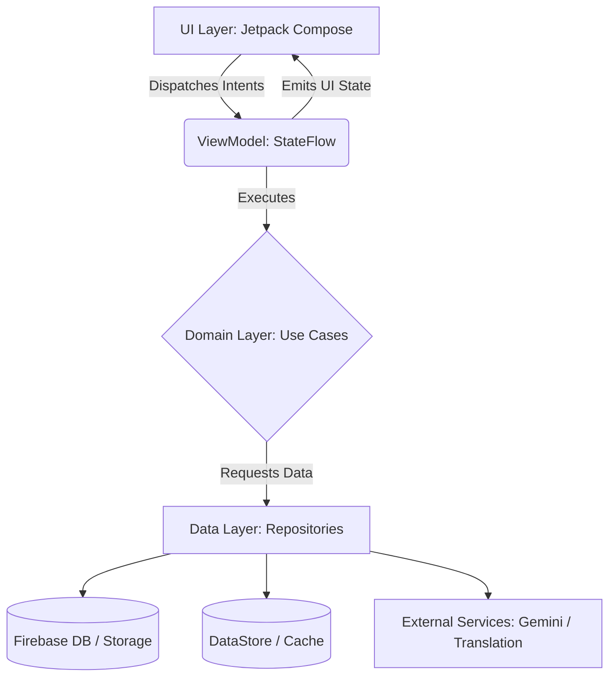
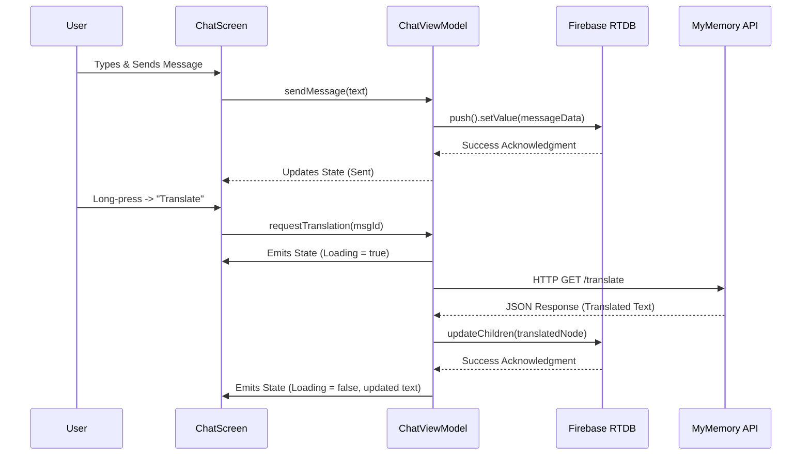
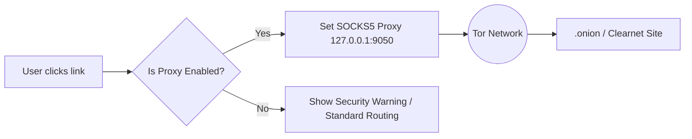

<p align="center">
  
</p>

<h1 align="center">Nexus Chat</h1>

<p align="center">
  <strong>An ultra-secure, feature-rich, and AI-powered modern Android messaging platform.</strong>
</p>

<p align="center">
  <a href="#overview">Overview</a> •
  <a href="#key-features">Key Features</a> •
  <a href="#architecture--system-design">Architecture</a> •
  <a href="#security--privacy-model">Security Model</a> •
  <a href="#data-flow--diagrams">Flow Diagrams</a> •
  <a href="#getting-started">Getting Started</a>
</p>

---

## 🚀 Overview

**Nexus Chat** is a next-generation Android messaging application engineered for absolute privacy, rich feature sets, and seamless artificial intelligence integration. Developed entirely in Kotlin using **Jetpack Compose** and adhering to **Clean Architecture** principles, Nexus Chat sets a new standard for mobile communication.

The platform goes far beyond standard real-time messaging by embedding a **Tor Browser Proxy** for anonymous network routing, **End-to-End Encrypted Backups** (`.azelback`), an in-app **Code Execution Environment**, and an intelligent assistant powered by Google's **Gemini AI**.

---

## ✨ Key Features

### 💬 Advanced Messaging Ecosystem
*   **Real-Time Synchronization:** Instant message delivery, typing indicators, and presence updates driven by Firebase Realtime Database.
*   **Rich Media Handling:** Share high-resolution images, voice notes, and documents with optimized, memory-efficient caching via **Coil 3**.
*   **In-line Auto Translation:** Break language barriers with real-time, in-chat message translation utilizing the MyMemory API.
*   **Ephemeral Stories:** Share photos and videos with an expiration timer, complete with a custom built-in Story Editor.

### 🛡️ State-of-the-Art Security & Privacy
*   **Biometric App Lock:** Prevent unauthorized physical access using device-native Biometrics (Fingerprint/Face Recognition) or a fallback cryptographic PIN.
*   **Tor Network Integration:** Route sensitive in-app web traffic and access `.onion` hidden services anonymously via Orbot proxy integration (SOCKS5).
*   **AES-256-GCM Encrypted Backups:** Export your entire chat history into secure `.azelback` archives, encrypted with PBKDF2 derived keys.
*   **Granular Privacy Controls:** Manage Read Receipts, Last Seen timestamps, and Profile Photo visibility dynamically.

### 🤖 Gemini AI Integration
*   **Intelligent Assistant:** A deeply integrated AI that analyzes context, summarizes long chat threads, and answers complex queries directly in your DMs.
*   **Contextual Awareness:** Powered by Google's Generative AI, providing adaptive and conversational responses.

### 💻 Built-In Developer Environment
*   **Sora Code Editor:** Write and format code with syntax highlighting without leaving the app.
*   **Local Execution:** Run Python, JavaScript, Bash, C, and Kotlin scripts natively within the application's secure sandbox.

### 📞 High-Fidelity WebRTC Calls
*   **Peer-to-Peer Architecture:** Direct, low-latency audio and video calls established via WebRTC signaling.
*   **Comprehensive Call Logs:** Track call durations, types, and timestamps with built-in search and filtering.

---

## 🏗️ Architecture & System Design

Nexus Chat strictly implements **Clean Architecture** to ensure modularity, scalability, and testability. The application is divided into three primary layers, bound together by **Dagger Hilt** for dependency injection.

### 1. Presentation Layer (UI)
Built entirely with **Jetpack Compose (Material 3)**.
*   **MVI/MVVM Pattern:** State is managed via `StateFlow` and `SharedFlow`.
*   **Unidirectional Data Flow (UDF):** The UI dispatches Intent events to the ViewModel, which processes the logic and emits immutable State objects back to the UI.

### 2. Domain Layer
Contains the core business logic.
*   **Use Cases / Interactors:** Encapsulates distinct business rules (e.g., `EncryptBackupUseCase`, `TranslateMessageUseCase`).
*   **Domain Models:** Pure Kotlin data classes representing core entities, devoid of any framework dependencies.

### 3. Data Layer
Manages data retrieval and persistence.
*   **Repositories:** Abstractions over data sources (Network vs. Local).
*   **Remote Data Sources:** Firebase Realtime Database, Firebase Storage, External APIs (Gemini, MyMemory).
*   **Local Data Sources:** Jetpack DataStore (Preferences), AES Encrypted Files (`.azelback`).

---

## 🔒 Security & Privacy Model

Security is the foundational pillar of Nexus Chat. The application employs defense-in-depth strategies:

1.  **At-Rest Encryption:** User preferences and sensitive tokens are stored using Encrypted SharedPreferences/DataStore.
2.  **Encrypted Exports:** The `EncryptedBackupManager` utilizes `AES/GCM/NoPadding`. Keys are dynamically derived using `PBKDF2WithHmacSHA256` with a random salt for every backup session.
3.  **True Data Erasure:** Deleting a media message triggers a direct deletion command to Firebase Storage buckets, ensuring files are physically erased and not just unlinked from the database node.
4.  **Network Anonymization:** Users can toggle the "Tor Mode" which enforces a proxy configuration (`127.0.0.1:9050`) on the embedded WebView and internal network clients, securing traffic against ISP monitoring.

---

## 📊 Data Flow & Diagrams

### 1. High-Level Architecture Flow



### 2. Real-Time Chat & Translation Lifecycle



### 3. Encrypted Backup Pipeline (.azelback)

```mermaid
flowchart TD
    Init([User initiates Export]) --> Prompt[Prompt for Encryption Password]
    Prompt --> Fetch[Fetch JSON Chat Tree from Firebase]
    Fetch --> KDF[Key Derivation: PBKDF2(Password + Random Salt)]
    KDF --> Encrypt[Encrypt payload: AES-256-GCM]
    Encrypt --> Package[Package payload + IV + Salt into .azelback]
    Package --> Save([Write to Local Storage])
```

### 4. Anonymous Routing via Tor (Orbot)



---

## 💻 Technical Stack

| Component | Technology | Description |
| :--- | :--- | :--- |
| **Language** | Kotlin | 100% Kotlin codebase |
| **UI Framework** | Jetpack Compose | Material 3 Design System |
| **Architecture** | Clean + MVVM | Strict separation of concerns |
| **Dependency Injection**| Dagger Hilt | Compile-time dependency graph |
| **Backend / DB** | Firebase | Auth, Realtime DB, Storage |
| **Image Loading** | Coil 3 | Coroutine-based image loading |
| **Concurrency** | Kotlin Coroutines | Asynchronous, non-blocking programming |
| **Reactive Streams** | StateFlow / SharedFlow | Modern alternative to LiveData |
| **AI Processing** | Google Gemini SDK | Generative AI integration |
| **Local Storage** | Jetpack DataStore | Type-safe asynchronous preferences |
| **Cryptography** | `javax.crypto` | Native AES-256-GCM implementation |

---

## 🛠️ Getting Started

### Prerequisites
*   **IDE:** Android Studio Ladybug (or latest stable version).
*   **SDK:** Minimum SDK 24, Target SDK 34+.
*   **Java:** JDK 17+.

### Setup Instructions

1.  **Clone the Repository:**
    ```bash
    git clone https://github.com/YourUsername/Nexus-Chat.git
    cd Nexus-Chat
    ```

2.  **Configure Firebase Backend:**
    *   Navigate to the [Firebase Console](https://console.firebase.google.com/).
    *   Create a new project and register an Android app (`com.Azelmods.App`).
    *   Download `google-services.json` and place it in the `app/` module directory.
    *   Enable **Email/Password Authentication**, **Realtime Database**, and **Storage**.

3.  **Configure API Keys (Local Properties):**
    *   Create or open the `local.properties` file in the root directory.
    *   Add your Gemini API Key:
        ```properties
        GEMINI_API_KEY=your_google_gemini_api_key_here
        ```

4.  **Build and Execute:**
    *   Sync the project with Gradle files in Android Studio.
    *   Select your physical device or emulator.
    *   Run the project (`Shift + F10`) or use the Gradle wrapper:
        ```bash
        ./gradlew assembleDebug
        ```

---

## 🤝 Contribution Guidelines

We welcome pull requests for bug fixes, new features, and documentation improvements!

1. Fork the Project.
2. Create your Feature Branch (`git checkout -b feature/InnovativeFeature`).
3. Ensure your code adheres to standard Kotlin style guidelines (ktlint).
4. Commit your Changes (`git commit -m 'Add some InnovativeFeature'`).
5. Push to the Branch (`git push origin feature/InnovativeFeature`).
6. Open a Pull Request for review.

---

## 📄 License

This software is distributed under the MIT License. See the [LICENSE](LICENSE) file for more information.

---
<p align="center">
  <i>Engineered with precision for secure, rapid, and modern communication.</i>
</p>
