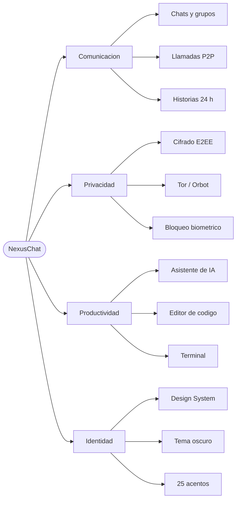
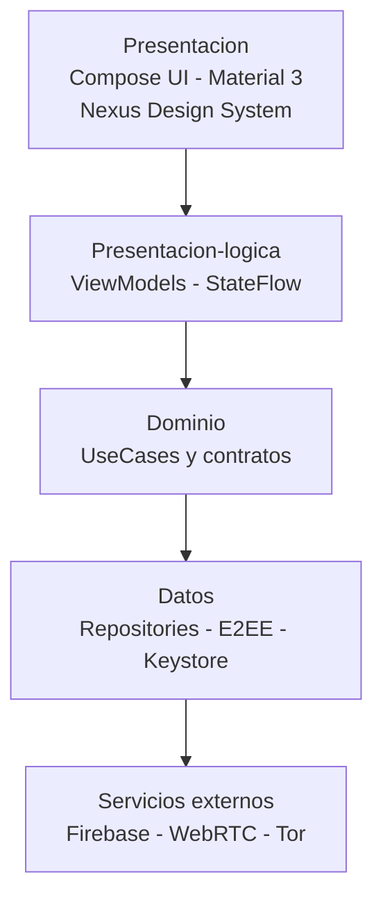
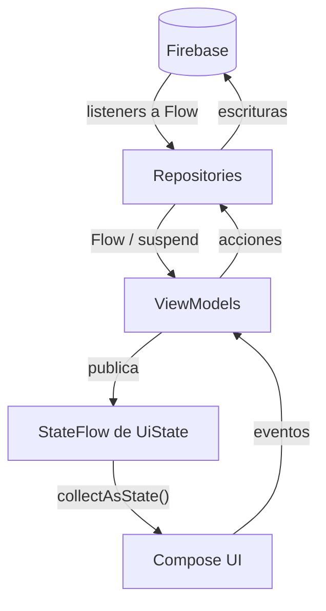
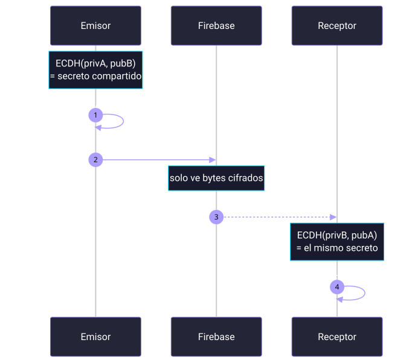
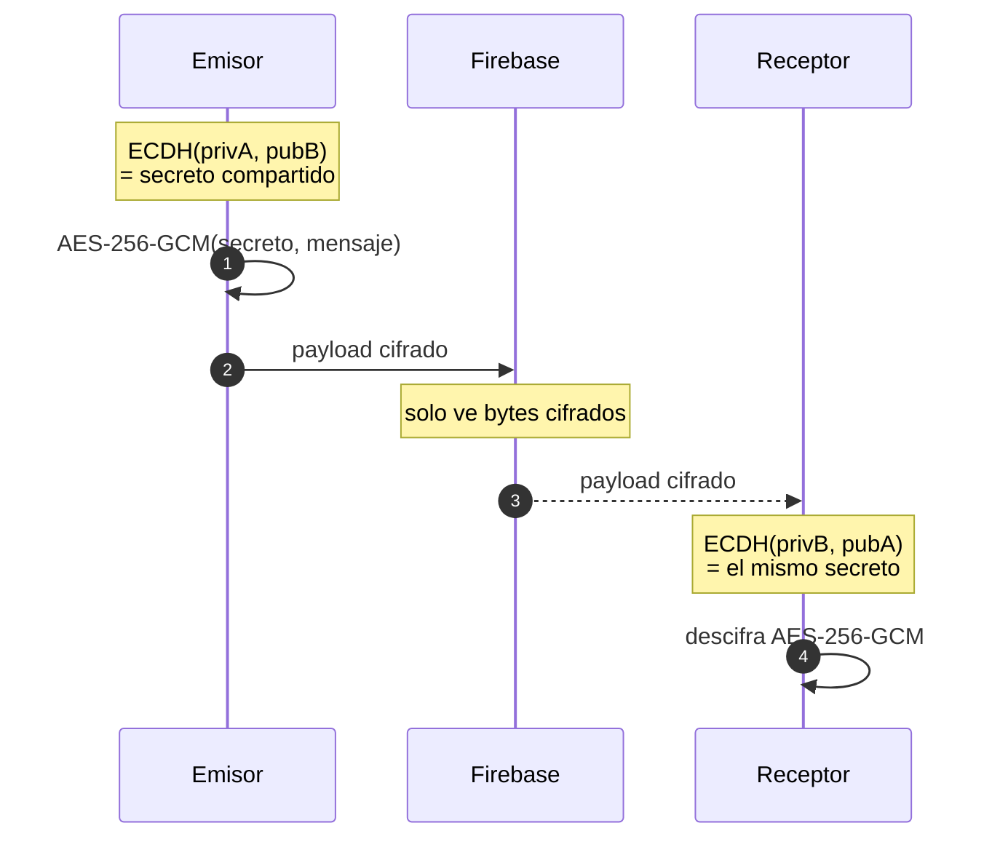
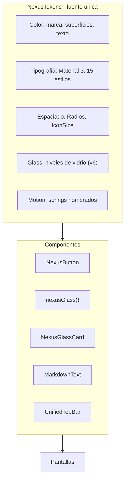
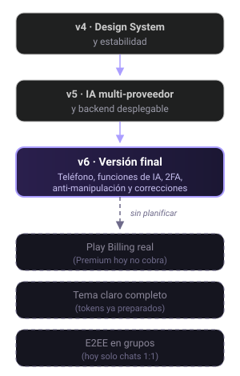
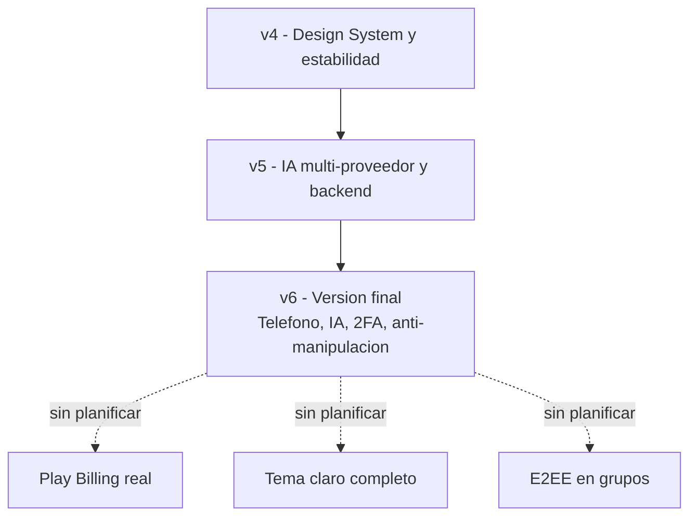

<h1 align="center">NexusChat</h1>

<p align="center">
  
  
  
  
  
  
  
  
</p>

<p align="center">
  <strong>Mensajería en tiempo real con la privacidad como requisito de diseño.</strong><br>
  NexusChat es una aplicación Android nativa de chat con cifrado de extremo a extremo
  (ECDH&nbsp;+&nbsp;AES-256-GCM), llamadas de voz y video P2P, historias efímeras,
  navegación anónima vía Tor y un asistente de IA con proveedor configurable — construida
  íntegramente con <strong>Kotlin</strong> y <strong>Jetpack&nbsp;Compose</strong> sobre un
  Design System propio.
</p>

---

## Índice

1. [Visión general](#visión-general)
2. [Por qué usarla como plantilla](#por-qué-usarla-como-plantilla)
3. [Arquitectura](#arquitectura)
4. [Flujo de un mensaje cifrado](#flujo-de-un-mensaje-cifrado)
5. [Estructura del proyecto](#estructura-del-proyecto)
6. [Funciones](#funciones)
7. [Nexus Design System](#nexus-design-system)
8. [Stack técnico](#stack-técnico)
9. [Seguridad y privacidad](#seguridad-y-privacidad)
10. [Integridad y anti-manipulación](#integridad-y-anti-manipulación)
11. [Compilar el proyecto](#compilar-el-proyecto)
12. [Roadmap](#roadmap)
13. [Novedades de la v6](#novedades-de-la-v6)
14. [Novedades de la v5](#novedades-de-la-v5)
15. [Autoría](#autoría)
16. [Licencia](#licencia)

---

## Visión general

NexusChat no es un clon de un mensajero existente: combina comunicación en tiempo real
con un conjunto de herramientas de privacidad y productividad poco habituales en el género
—navegador Tor integrado, editor de código, terminal y asistente de IA— bajo una identidad
visual coherente y oscura.

<p align="center">
  
</p>

<details>
<summary>Codigo Mermaid de este diagrama</summary>


```mermaid
flowchart LR
    N(["NexusChat"])
    N --> C["Comunicacion"]
    N --> P["Privacidad"]
    N --> T["Productividad"]
    N --> I["Identidad"]
    C --> C1["Chats y grupos"]
    C --> C2["Llamadas P2P"]
    C --> C3["Historias 24 h"]
    P --> P1["Cifrado E2EE"]
    P --> P2["Tor / Orbot"]
    P --> P3["Bloqueo biometrico"]
    T --> T1["Asistente de IA"]
    T --> T2["Editor de codigo"]
    T --> T3["Terminal"]
    I --> I1["Design System"]
    I --> I2["Tema oscuro"]
    I --> I3["25 acentos"]
```

</details>

## Por qué usarla como plantilla

La mayoría de las plantillas de chat que se publican resuelven la parte fácil —una lista de
mensajes y un campo de texto— y dejan fuera justo lo que cuesta semanas: el cifrado, la
señalización de llamadas, las notificaciones push, las reglas del backend y un sistema de
diseño que no se desmorone al añadir la décima pantalla.

NexusChat parte del otro lado. Está pensada para quien quiere **estudiar una app Android
completa y de verdad**, o usarla como cimiento de la suya:

| Lo que suele faltar en una plantilla | Lo que encuentras aquí |
|---|---|
| Cifrado de adorno o inexistente | **E2EE real**: ECDH P-256 + AES-256-GCM, con las claves generadas en el dispositivo |
| Llamadas simuladas o sin señalización | **WebRTC P2P** con señalización sobre Firebase e historial de llamadas |
| Notificaciones que no llegan | **Cloud Functions propias** desplegables, no un servicio de terceros |
| Backend sin reglas de seguridad | **Reglas de Firebase versionadas** en el repositorio y desplegables con un comando |
| Colores y tamaños repartidos por 40 archivos | **Nexus Design System** como única fuente de verdad de color, espaciado y tipografía |
| Botones que no hacen nada | Cada función de la interfaz **está implementada**; lo que no lo está, se dice |

Tres decisiones de diseño que hacen que sirva como base y no solo como demo:

- **Arquitectura sin atajos.** MVVM + Repository con flujo unidireccional y capas separadas
  (`ui/`, `domain/`, `data/`). Cambiar Firebase por otro backend es tocar la capa de datos,
  no la app entera.
- **Honestidad técnica.** Donde una función tiene límites —los grupos aún no van cifrados de
  extremo a extremo, la pantalla Premium no cobra— el README **y la propia app** lo dicen.
  Una plantilla que exagera lo que hace te hace perder tiempo cuando la abres por dentro.
- **Todo el flujo, de punta a punta.** Registro, sesión, chat, cifrado, llamadas, historias,
  ajustes, copias de seguridad y publicación firmada. No hay que "imaginarse" ninguna pieza.

> **Estado del proyecto.** La **v6 es la versión final**: cierra el ciclo de desarrollo y
> **no está previsto que reciba nuevas actualizaciones durante un tiempo**. Se publica
> completa y estable, con licencia MIT, precisamente para que sea un punto de partida sólido
> y no un proyecto en movimiento del que dependas.

## Arquitectura

NexusChat sigue **MVVM + Repository** con **flujo de datos unidireccional (UDF)**: la
interfaz es una función del estado, y el estado fluye siempre en una sola dirección. Los
datos en tiempo real de Firebase se exponen como `Flow`, los ViewModels los transforman en
un `StateFlow` inmutable, y Compose se recompone automáticamente cuando ese estado cambia.

### Capas

<p align="center">
  
</p>

<details>
<summary>Codigo Mermaid de este diagrama</summary>


```mermaid
flowchart TD
    P["Presentacion<br>Compose UI - Material 3<br>Nexus Design System"]
    L["Presentacion-logica<br>ViewModels - StateFlow"]
    D["Dominio<br>UseCases y contratos"]
    DA["Datos<br>Repositories - E2EE - Keystore"]
    E["Servicios externos<br>Firebase - WebRTC - Tor"]
    P --> L --> D --> DA --> E
```

</details>

### Ciclo reactivo

<p align="center">
  
</p>

<details>
<summary>Codigo Mermaid de este diagrama</summary>


```mermaid
flowchart TD
    FB[("Firebase")] -->|"listeners a Flow"| REPO["Repositories"]
    REPO -->|"Flow / suspend"| VM["ViewModels"]
    VM -->|"publica"| STATE["StateFlow de UiState"]
    STATE -->|"collectAsState()"| UI["Compose UI"]
    UI -->|"eventos"| VM
    VM -->|"acciones"| REPO
    REPO -->|"escrituras"| FB
```

</details>

Principios que sostienen el diseño:

- **Reactividad:** en un chat los datos cambian solos (mensajes entrantes, presencia,
  typing). No hay "refresh" manual: Firebase notifica, el flujo emite y la UI reacciona.
- **Estado que sobrevive a la UI:** los ViewModels viven más que los Composables, por lo
  que rotar la pantalla o navegar no recarga el chat.
- **Capas reemplazables:** la UI no conoce Firebase; el acceso a datos está encapsulado en
  repositories inyectados con Hilt.

## Flujo de un mensaje cifrado

El servidor **nunca** ve texto plano. El cifrado ocurre en el dispositivo del emisor y solo
el receptor puede descifrar, usando un secreto compartido derivado con ECDH.

<p align="center">
  
</p>

<details>
<summary>Codigo Mermaid de este diagrama</summary>


```mermaid
sequenceDiagram
    autonumber
    participant A as Emisor
    participant FB as Firebase
    participant B as Receptor

    Note over A: ECDH(privA, pubB)<br/>= secreto compartido
    A->>A: AES-256-GCM(secreto, mensaje)
    A->>FB: payload cifrado
    Note over FB: solo ve bytes cifrados
    FB-->>B: payload cifrado
    Note over B: ECDH(privB, pubA)<br/>= el mismo secreto
    B->>B: descifra AES-256-GCM
```

</details>

## Estructura del proyecto

```
app/src/main/java/com/Azelmods/App/
├── data/              # Capa de datos
│   ├── repository/    #   Repositories (RTDB, Storage, fondos de chat…)
│   ├── model/         #   Modelos (User, Message, Chat…)
│   ├── security/      #   Cifrado E2EE (ECDH + AES-256-GCM) y almacenamiento seguro
│   ├── ai/            #   AiKeyStore (clave de IA cifrada) y cola de peticiones
│   ├── translation/   #   Servicio de traducción de mensajes
│   ├── local/         #   Caché local de mensajes
│   ├── preferences/   #   Preferencias de usuario y tema (DataStore)
│   └── …              #   api, backup, chat, firebase, session, work
├── di/                # Módulos de inyección de dependencias (Hilt)
├── domain/
│   ├── repository/    # Contratos de la capa de dominio
│   └── usecase/       # Casos de uso (cifrado, backups, stories…)
├── security/          # App lock, detección de root/tampering
├── service/           # Servicios en segundo plano (FCM, notificaciones)
├── ui/
│   ├── components/    # Composables reutilizables (NexusButton, NexusGlassCard…)
│   ├── navigation/    # NavGraph y rutas
│   ├── screens/       # Pantallas por feature (chat, home, calls, stories…)
│   └── theme/         # Nexus Design System: tokens, color, tipografía, motion
├── webrtc/            # Motor de llamadas (PeerConnection, cámara, audio)
└── utils/             # Utilidades compartidas
```

## Funciones

### Disponibles hoy

- **Mensajería en tiempo real** — chats 1:1 y grupos sobre Firebase Realtime Database, con
  indicador de escritura, confirmaciones de lectura, respuestas, edición y borrado de
  mensajes, stickers y notas de voz.
- **Cifrado de extremo a extremo (E2EE)** — intercambio de claves **ECDH** por destinatario
  y cifrado autenticado **AES-256-GCM**; el servidor solo almacena el payload cifrado.
- **Llamadas de voz y video (WebRTC)** — audio/video peer-to-peer con señalización vía
  Firebase; el stream viaja directo entre dispositivos.
- **Historias (Stories)** — contenido efímero de 24 horas con reacciones y respuestas,
  **música** que acompaña a la historia y **dibujo a mano alzada** sobre la foto.
- **Navegación anónima (Tor/Orbot)** — navegador integrado que enruta el tráfico por la red
  Tor delegando en Orbot como proxy local, con detección de conexión en tiempo real y
  fallback automático de proxy HTTP a SOCKS5.
- **Asistente de IA multi-proveedor** — el usuario elige proveedor, modelo y clave:
  **Gemini, OpenAI, OpenRouter, DeepSeek, Mistral, Groq, Ollama local** o cualquier endpoint
  propio compatible con OpenAI (LM Studio, vLLM, llama.cpp). La clave se guarda cifrada en el
  dispositivo y nunca sale de él salvo hacia el proveedor elegido.
- **Traducción de mensajes** — traducción on-demand por mensaje con detección de idioma,
  usando tu propio modelo cuando hay uno configurado y una memoria de traducción gratuita
  como respaldo.
- **Seis funciones de IA sobre la conversación** — respuestas sugeridas, auto-traducción de
  mensajes entrantes, resumen de la conversación, reescritura por tono, mejora de fotos al
  enviarlas y dictado por voz. Todas **nacen apagadas**: las que envían texto a un proveedor
  externo no pueden activarse solas en una app con cifrado de extremo a extremo.
- **Editor de código con resaltado de sintaxis** — HTML, CSS, JS, **TypeScript, JSX, TSX,
  JSON**, Python, Kotlin, Bash y C. Vista previa real de HTML/CSS en WebView, ejecución de
  JavaScript, y validación con formateo de JSON sin salir del dispositivo.
- **Terminal integrado** — shell real de Android con historial navegable, alias, `sysinfo` y
  prompt con el directorio actual.
- **Acceso por correo, Google o número de teléfono** — verificación por SMS con reenvío
  controlado y verificación instantánea cuando Android la ofrece.
- **Personalización** — 25 acentos de color, fondos de chat (imagen o video), tamaño de
  fuente que escala toda la interfaz y modo oscuro.
- **Protección local** — bloqueo biométrico o por PIN, **verificación en dos pasos (TOTP)** y
  copias de seguridad cifradas con AES-256 que se exportan a donde tú elijas.

## Nexus Design System

La identidad visual de NexusChat vive en un Design System propio (`ui/theme/`) que actúa como
**única fuente de verdad**: ninguna pantalla hardcodea colores, tamaños, radios ni tipografías.

<p align="center">
  
</p>

<details>
<summary>Codigo Mermaid de este diagrama</summary>


```mermaid
flowchart TD
    subgraph NT["NexusTokens - fuente unica"]
        COL["Color: marca, superficies, texto"]
        TYP["Tipografia: Material 3, 15 estilos"]
        SP["Espaciado, Radios, IconSize"]
        GL["Glass: niveles de vidrio (v6)"]
        MO["Motion: springs nombrados"]
    end
    subgraph CMP["Componentes"]
        B["NexusButton"]
        G["nexusGlass()"]
        GC["NexusGlassCard"]
        MD["MarkdownText"]
        TB["UnifiedTopBar"]
    end
    NT --> CMP --> SCR["Pantallas"]
```

</details>

Pilares del sistema:

- **Color semántico y accesible** — una sola paleta de marca (violeta `#7C6FE0` → cian),
  con un **test de contraste WCAG** (`NexusPaletteContrastTest`) que rompe la compilación si
  un par texto/superficie deja de cumplir el mínimo legible.
- **Tipografía completa** — los 15 estilos de Material 3 definidos con criterio de pesos
  (SemiBold para énfasis, Normal para lectura); 10–12sp reservado a metadatos.
- **Glassmorphism canónico** — un único modificador `Modifier.nexusGlass()` define la
  superficie de vidrio de la app; los componentes lo consumen en vez de reconstruirla.
- **Motion con propósito** — curvas spring nombradas (`springDefault` / `springBouncy`) que
  las pantallas consumen, en lugar de inventar animaciones locales.
- **Identidad oscura** — fondo oscuro-primero con gradientes de marca, y **25 acentos**
  seleccionables por el usuario, integrados con el `ColorScheme` de Material 3.

> Documentación de diseño completa en [`docs/`](docs/): auditoría, principios y sistema.

## Stack técnico

| Tecnología | Rol | Por qué |
|---|---|---|
| **Kotlin 2.1.20** | Lenguaje | Null-safety, corrutinas y `Flow` nativos: la base de toda la reactividad. |
| **Jetpack Compose (Material 3)** | UI | UI declarativa: la interfaz es una función del estado, sin sincronizar vistas a mano. |
| **Firebase (Auth · RTDB · Storage)** | Backend | Sincronización en tiempo real con listeners push, autenticación y media gestionadas. |
| **Hilt 2.54** | Inyección de dependencias | Grafo validado en compilación e integrado al ciclo de vida (`@HiltViewModel`). |
| **WebRTC** | Llamadas | Estándar abierto para audio/video P2P de baja latencia. |
| **ECDH + AES-256-GCM** | Cifrado | Acuerdo de claves por curva elíptica + cifrado autenticado para el E2EE. |
| **Tor / Orbot · NetCipher** | Anonimato | Enrutado del navegador integrado por la red Tor. |
| **MVVM + Repository** | Arquitectura | Separa UI, estado y datos: cada capa se testea y reemplaza aislada. |
| **minSdk 31 / targetSdk 36** | Compatibilidad | Android 12+ con las APIs modernas de Android 16 (edge-to-edge). |

## Seguridad y privacidad

La privacidad del usuario es un requisito de diseño, no una opción:

- **Cifrado de extremo a extremo:** el contenido se cifra en el dispositivo con **AES-256-GCM**
  usando un secreto derivado por **ECDH** entre emisor y receptor. El backend solo ve datos
  cifrados: ni el servidor ni un tercero con acceso a la base de datos leen las conversaciones.
- **Navegación anónima:** el navegador integrado enruta su tráfico por la red **Tor** (vía
  Orbot), ocultando la IP de origen y dificultando el rastreo de la navegación.
- **Protección local:** bloqueo con biometría o PIN, **verificación en dos pasos (2FA)**
  mediante TOTP compatible con Google Authenticator/Aegis, backups cifrados con AES-256 y
  detección de entornos comprometidos (root/tampering).
- **Claves bajo control del usuario:** las credenciales opcionales (como la clave del
  asistente de IA) se guardan cifradas con `EncryptedSharedPreferences` respaldado por el
  Android Keystore, y nunca se envían a servidores propios.

> **Nota responsable:** las funciones de privacidad están pensadas para proteger la
> comunicación legítima. El proyecto no promueve ningún uso contrario a las leyes aplicables.

## Integridad y anti-manipulación

El binario lleva una **firma de autoría** verificable: `IntegrityGuard` comprueba en el
arranque que el APK esté firmado con el certificado de Azel Mods. Si alguien recompila,
reempaqueta o vuelve a firmar la app con otra clave —lo necesario para redistribuirla como
propia—, la firma cambia y, **en un build de release**, la app se autodestruye.

Es deliberadamente conservador para no estorbar al desarrollo:

- En **debug** nunca se dispara.
- En **release sin configurar** tampoco: falla "en abierto" hasta que fijes tu huella.
- Solo se autodestruye un **release firmado por una clave desconocida** cuando ya has
  fijado la tuya.

La huella **no se guarda en claro**: en el código vive solo el `SHA-256` de la huella
`SHA-256` del certificado (una "cripto oculta" irreversible). Para activarlo en tu propio
release, calcula la marca de tu keystore y pégala en `IntegrityGuard.RELEASE_MARK`:

```bash
# 1) Huella SHA-256 de tu certificado de release (sin los dos puntos, en mayúsculas)
keytool -list -v -keystore tu-release.jks -alias tu-alias \
  | grep -i 'SHA256:' | awk '{print $2}' | tr -d ':' | tr 'a-f' 'A-F'

# 2) Marca = SHA-256 de esa huella (esto es lo que va en RELEASE_MARK)
printf 'PEGA_AQUI_LA_HUELLA_DEL_PASO_1' | sha256sum | awk '{print toupper($1)}'
```

Mientras `RELEASE_MARK` esté vacío, el anti-tamper solo avisa por log. La marca del build
**debug** del autor ya viene incluida, así que la depuración funciona sin tocar nada.

## Compilar el proyecto

### Requisitos

- **Android Studio** reciente (con soporte para compileSdk 36)
- **JDK 17**
- Dispositivo o emulador con **Android 12 (API 31)** o superior
- Un proyecto de **Firebase** en **plan Blaze** — Cloud Functions no está en el plan gratuito
- **Node 22** y **Firebase CLI** (`npm install -g firebase-tools`) para desplegar el backend

### Pasos

```bash
# 1. Clonar el repositorio
git clone https://github.com/Azelmods677/NexusChat.git
cd NexusChat

# 2. Configurar Firebase
#    - Crear un proyecto en https://console.firebase.google.com
#    - Habilitar Authentication, Realtime Database y Storage
#    - Descargar google-services.json y colocarlo en app/
#    - Poner tu project id en .firebaserc

# 3. Desplegar las reglas de seguridad
firebase deploy --only database
firebase deploy --only storage

# 4. Desplegar las Cloud Functions  ← IMPRESCINDIBLE
cd functions && npm install && cd ..
firebase deploy --only functions

# 5. Compilar
./gradlew assembleDebug

# 6. Instalar en un dispositivo conectado
./gradlew installDebug
```

> **El paso 3 es obligatorio.** Las reglas de `database.rules.json` son las que permiten
> listar contactos en *Nueva conversación*, crear grupos y usar el botón **+** de Llamadas.
> Con reglas antiguas desplegadas, esas tres pantallas fallan con *"failed to contact
> database"* aunque el código de la app sea correcto: las reglas viven en el servidor, no
> en el APK.

> **El paso 4 es obligatorio.** Las Cloud Functions entregan las notificaciones push, incluido
> el aviso de llamada entrante. Sin desplegarlas, las llamadas no suenan y no llegan
> notificaciones con la app cerrada.
>
> Los tokens de push se guardan ahora en el nodo raíz `fcmTokens/{uid}`. Si actualizas desde
> una versión anterior, **redespliega también las functions**: leen las dos rutas durante la
> migración, así que ningún dispositivo se queda sin notificaciones.

La señalización de llamadas y la sincronización de mensajes no necesitan ningún servidor
adicional: usan el proyecto de Firebase configurado. La navegación Tor requiere tener
[Orbot](https://guardianproject.info/apps/org.torproject.android/) instalado en el dispositivo.

### Firma de release (solo para publicar)

El `buildType release` lee las credenciales de `keystore.properties`, que está en
`.gitignore` y **nunca debe subirse**. Si el archivo no existe, el build avisa y firma en
debug — suficiente para instalar y compartir el APK, pero Google Play lo rechaza.

```bash
keytool -genkey -v -keystore nexuschat-release.jks -keyalg RSA \
        -keysize 2048 -validity 10000 -alias nexuschat
cp keystore.properties.example keystore.properties   # y rellenar
```

Guarda el `.jks` con tu vida: si lo pierdes, no podrás volver a actualizar la app en Play.

### Modelos de IA locales

Los servidores locales (Ollama, LM Studio, llama.cpp) hablan HTTP en claro, y
`network_security_config.xml` solo lo permite en **loopback** y en el host del emulador
(`10.0.2.2`) — no se abre la red entera. En un móvil físico, redirige el puerto:

```bash
adb reverse tcp:11434 tcp:11434
```

y usa `http://127.0.0.1:11434/v1`. Para una IP de la LAN hay que añadirla a mano a
`network_security_config.xml`: Android no acepta rangos CIDR ahí.

## Roadmap

<p align="center">
  
</p>

<details>
<summary>Codigo Mermaid de este diagrama</summary>


```mermaid
flowchart TD
    A["v4 - Design System y estabilidad"] --> B["v5 - IA multi-proveedor y backend"]
    B --> C["v6 - Version final<br>Telefono, IA, 2FA, anti-manipulacion"]
    C -. sin planificar .-> D["Play Billing real"]
    C -. sin planificar .-> E["Tema claro completo"]
    C -. sin planificar .-> F["E2EE en grupos"]
```

</details>

La v6 cierra el recorrido. Lo que queda por debajo **no está planificado para una próxima
versión**: se documenta como lo que es —los límites conocidos de esta entrega— para que
quien parta de esta plantilla sepa exactamente qué tendría que construir por su cuenta.

- **Play Billing real** — la pantalla Premium muestra los planes previstos pero **no cobra
  nada**, y lo dice explícitamente. No se simula ninguna compra.
- **Tema claro completo** — la infraestructura de tokens está lista desde la v4; falta
  repasar pantalla por pantalla.
- **E2EE en grupos** — hoy solo se cifran de extremo a extremo los chats 1:1.
- **Servidor TURN propio** — las llamadas usan los STUN públicos de Google y, como
  respaldo para NAT restrictivos (redes corporativas, algunas 4G), el TURN **gratuito
  y compartido** `openrelay.metered.ca`. Funciona para probar, pero si publicas una app
  basada en esta plantilla **monta tu propio TURN** (coturn, Twilio, Metered de pago):
  el gratuito no da garantías de disponibilidad y su tráfico pasa por un tercero. Se
  cambia en un solo sitio, `WebRTCManager.kt` → `iceServers`.

## Novedades de la v6

La v6 es la version final. Se centra en dos cosas: cerrar los fallos que impedian
usar la app con normalidad y activar las funciones que llevaban versiones a medias.

### Correcciones que desbloquean el uso diario

- **Cifrado legible en los dos lados.** El emisor veia su propio mensaje como
  "Mensaje cifrado de extremo a extremo" y el receptor como "No se pudo descifrar".
  Eran dos fallos: no se descifraban los mensajes propios (el secreto ECDH es
  simetrico, asi que la misma clave sirve para ambos sentidos) y el par de claves
  se guardaba por dispositivo en vez de por cuenta, de modo que dos sesiones en el
  mismo movil se pisaban las claves.
- **Llamadas y videollamadas.** Se pedia permiso de camara incluso para llamar por
  voz y la pantalla se bloqueaba si se denegaba; el contexto EGL del reproductor de
  video se liberaba justo al conectar, dejando la imagen en negro; y cada pantalla
  de llamada pisaba los callbacks de senalizacion de la anterior.
- **Borrar y vaciar conversaciones.** Borrar un chat no tocaba el indice
  `userChats`, que es lo que escucha la pantalla de inicio, asi que la conversacion
  seguia en la lista. "Clear Chat" no hacia nada en absoluto.
- **Fotos y reenvio.** Con Coil 3 `painter.state` es un `StateFlow`; el codigo lo
  trataba como el estado, de modo que descargar, compartir y reenviar respondian
  siempre "espera a que cargue la imagen".
- **Guia de bienvenida.** El bot demo emparejaba palabras por subcadena, y "ia"
  casaba dentro de "historias" y "gracias". Ahora compara palabras completas y
  explica que es NexusChat, por que existe y que hace.

### Entrar con numero de telefono

Tercera via de acceso junto al correo y Google: SMS con codigo de 6 digitos,
reenvio con cuenta atras y verificacion instantanea cuando Android la ofrece.

### Las seis funciones de IA, ya activas

Estaban en el codigo pero fuera de la interfaz porque eran interruptores
decorativos. Ahora tienen implementacion real y persisten en DataStore:

| Funcion | Que hace | Donde corre |
|---|---|---|
| Respuestas sugeridas | Tres respuestas rapidas sobre el teclado | Tu proveedor de IA |
| Traducir lo que recibo | Traduce los mensajes entrantes sin tocar el original | Tu proveedor de IA |
| Resumen de conversacion | Anade "Resumir chat" al menu | Tu proveedor de IA |
| Sugerencias de tono | Reescribe tu borrador: cercano, formal, corto, amable | Tu proveedor de IA |
| Mejorar fotos | Realce de contraste y color al enviar | En el dispositivo |
| Dictado por voz | Dicta el mensaje al campo de texto | Reconocedor de Android |

Todas nacen **apagadas**: las cuatro primeras envian parte de la conversacion al
proveedor configurado, y eso no puede ocurrir por defecto en una app con cifrado de
extremo a extremo. La pantalla de ajustes lo dice con esas palabras.

El traductor tambien usa ese modelo cuando esta disponible. La API gratuita anterior
es una memoria de traduccion: con mensajes cortos de chat devolvia la coincidencia
mas parecida que tuviera guardada, que a menudo no significaba lo mismo. Sigue como
respaldo cuando no hay clave configurada.

### Markdown en las respuestas de la IA

Encabezados, negrita, cursiva, listas, citas y bloques de codigo con etiqueta de
lenguaje y boton de copiar. Antes se leian los asteriscos y las comillas invertidas
tal cual.

### Nexus Design System v6

Nuevos tokens de **vidrio** (`NexusTokens.Glass`), **opacidad de texto por funcion**
(`Alpha`) y **elevacion semantica** (`Surface`). Hasta la v5 cada pantalla se
inventaba sus propios alfas, asi que dos superficies del mismo nivel se veian
distintas segun quien las hubiera escrito.

Las tarjetas de chat estrenan un **rail de acento** vertical en el borde izquierdo
cuando hay mensajes sin leer: antes lo unico que las distinguia era un borde de 1 dp
y un contador al otro extremo, invisible de un vistazo sobre un fondo de pantalla.
La pantalla de inicio conserva su transparencia.

### Cierre de la v6: seguridad y utilidades reales

Ronda final para que lo que estaba a medias funcione de verdad:

- **Verificacion en dos pasos (2FA) real.** Era un interruptor decorativo. Ahora genera
  un secreto **TOTP** (RFC 6238) compatible con Google Authenticator/Aegis, se confirma
  con un codigo al activarlo y se **exige un codigo de 6 digitos** tras el PIN o la huella
  en la pantalla de desbloqueo.
- **Copia de seguridad que exporta de verdad.** Antes escribia el fichero cifrado en una
  carpeta interna invisible en Android 11+. Ahora, tras crearla, se abre el selector del
  sistema para **guardar la copia donde tu quieras** (Descargas, Drive, etc.).
- **Tamano de letra que se nota.** El ajuste escalaba solo la tipografia de Material,
  pero casi toda la app fija el tamano en `sp` a mano. Ahora se escala la **densidad de
  fuente** del arbol entero: todo el texto crece o encoge por igual.
- **La IA ya no se cuelga.** Resumenes y traducciones podian quedarse cargando para
  siempre (la traduccion abria una conexion **sin timeout**). Ahora toda operacion de IA
  tiene un tope de tiempo y falla con un mensaje claro en vez de girar sin fin.
- **Terminal mas capaz.** Historial navegable con flechas, alias (`ll`, `la`), `sysinfo`
  estilo neofetch, prompt con el directorio actual y una fila de simbolos para teclear
  `/ ~ | > *` sin pelearse con el teclado.
- **Firma de autoria anti-manipulacion.** Ver [Integridad y anti-manipulación](#integridad-y-anti-manipulación).

## Novedades de la v5

La v5 abre la app a cualquier modelo de IA, convierte el editor en una herramienta de
desarrollo real y completa las historias con música y dibujo.

### Asistente de IA sin ataduras

El usuario decide con qué inteligencia habla. **Gemini, OpenAI, OpenRouter, DeepSeek,
Qwen, GLM (Z.ai), Kimi (Moonshot), Mistral, Groq, Ollama** o cualquier endpoint propio
compatible con OpenAI —LM Studio, vLLM, llama.cpp—, cada uno con su clave y su modelo.
La clave se guarda cifrada en el dispositivo.

El catálogo de modelos **no está grabado en la app**: el botón *Buscar modelos* consulta el
endpoint `/models` del proveedor y ofrece lo que realmente hay disponible en tu cuenta. Así,
cuando un proveedor publica una versión nueva, aparece sola —sin actualizar la app— y el
campo de modelo sigue siendo texto libre para casos a medida.

Incluye **modelos locales**: con Ollama corriendo en tu equipo, las conversaciones no salen
de tu red. Y el comportamiento del asistente lo define el modelo elegido, no la app.

### Editor de código de verdad

Resaltado de sintaxis para **HTML, CSS, JavaScript, TypeScript, JSX, TSX, JSON, Python,
Kotlin, Bash y C**, con vista previa real de HTML y CSS en WebView, ejecución de JavaScript
y validación con formateo de JSON, todo en el dispositivo y sin conexión.

### Historias completas

Añade **música** a una historia —la pista viaja con ella y suena en el visor, en bucle y
respetando la pausa— y **dibuja sobre la foto**: los trazos quedan grabados en la imagen que
se publica.

### Comunicación más sólida

- Mensajería y llamadas con **notificaciones push propias**, servidas desde Cloud Functions
- **Historial de llamadas** completo, tanto emitidas como recibidas
- Navegación **Tor** con detección de Orbot en tiempo real y selección automática de proxy

### Asistente de bienvenida que conversa

El **Demo Chat** ya no es un guion estático: escríbele y *Azel Assistant* responde
**mensaje a mensaje**, con pausas naturales, guiando un recorrido por las funciones de la
app. Pregúntale por *cifrado*, *Tor*, *IA*, *historias*, *llamadas* o *código* y te explica
cada una desde una conversación real, guardada en la base de datos como cualquier otra.

### Interfaz de la lista de chats

Cada conversación es ahora una **tarjeta** translúcida —el fondo del usuario se sigue
viendo— con anillo de acento solo cuando hay mensajes sin leer, respuesta táctil al pulsar y
menú de mantener pulsado (fijar, silenciar, archivar, eliminar) por fin accesible. Los
**checks de lectura** se dibujan a medida, con el azul de "visto" del design system.

### Lista para publicar

- **Firma de release** con keystore propio, fuera del repositorio
- Backend desplegable con un comando: reglas de seguridad y Cloud Functions
- La pantalla **Premium** muestra los planes previstos y deja claro que las suscripciones aún
  no están activas: no simula ninguna compra

## Autoría

**NexusChat está desarrollado y mantenido íntegramente por [Azel Mods](https://github.com/Azelmods677)**,
único autor y propietario del proyecto.

El código se publica como **plantilla para desarrolladores**: puedes clonarlo, estudiarlo,
modificarlo y construir tu propia app encima, según los términos de la licencia MIT. Se
distribuye únicamente por **GitHub y repositorios alternativos**, no por Google Play.

## Licencia

Distribuido bajo licencia **MIT**. Copyright © 2026 Azel Mods.
Ver [LICENSE](LICENSE) para más detalles.
