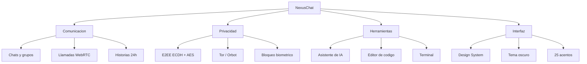
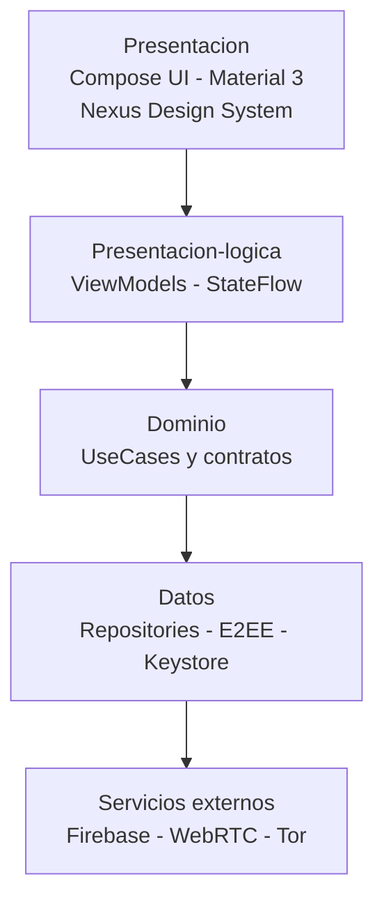
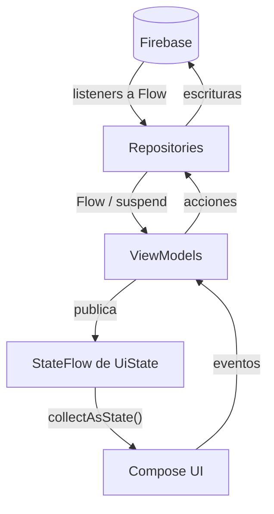
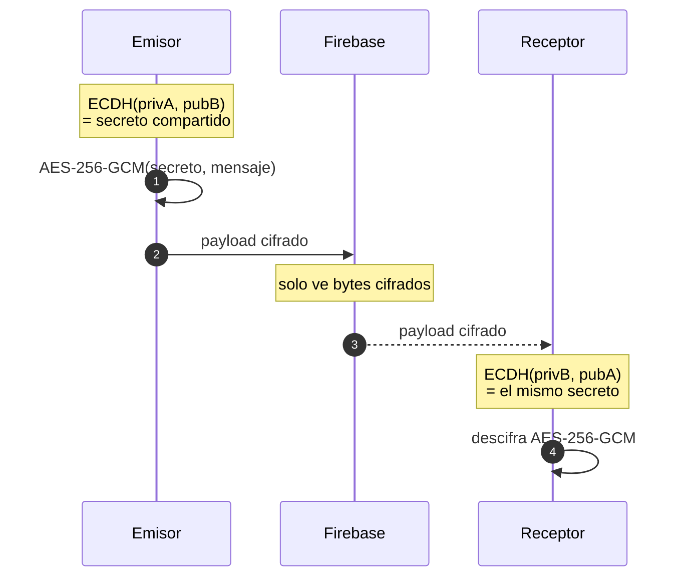
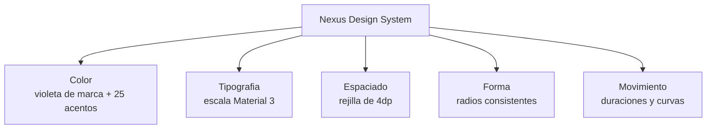
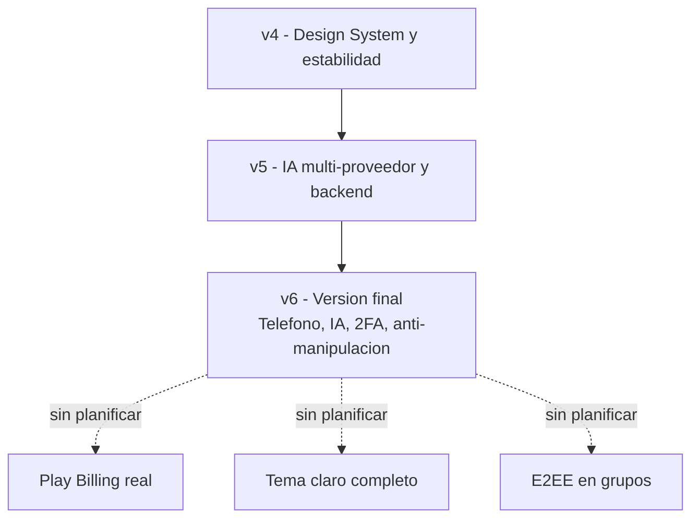

<h1 align="center">NexusChat</h1>

<p align="center">
  
  
  
  
  
  
  
  
  
</p>

<p align="center">
  <strong>Mensajería en tiempo real con la privacidad como requisito de diseño.</strong><br>
  Aplicación Android nativa con cifrado de extremo a extremo (ECDH&nbsp;+&nbsp;AES-256-GCM),
  llamadas de voz y vídeo P2P, historias efímeras, navegación anónima vía Tor y un asistente
  de IA con proveedor configurable — construida íntegramente con <strong>Kotlin</strong> y
  <strong>Jetpack&nbsp;Compose</strong> sobre un Design System propio.
</p>

<p align="center">
  <sub>
    Diseñado, desarrollado y mantenido en su totalidad por
    <a href="https://github.com/Azelmods677"><strong>Azel Mods</strong></a> — desarrollador único del proyecto.
  </sub>
</p>

---

## Índice

**Empezar**
1. [Visión general](#visión-general)
2. [Sobre el desarrollador](#sobre-el-desarrollador)
3. [Por qué elegir esta plantilla](#por-qué-elegir-esta-plantilla)
4. [El proyecto en cifras](#el-proyecto-en-cifras)

**Ingeniería**
5. [Arquitectura](#arquitectura)
6. [Flujo de un mensaje cifrado](#flujo-de-un-mensaje-cifrado)
7. [Estructura del proyecto](#estructura-del-proyecto)
8. [Decisiones de ingeniería](#decisiones-de-ingeniería)
9. [Stack técnico](#stack-técnico)

**Producto**
10. [Funciones en detalle](#funciones-en-detalle)
11. [Nexus Design System](#nexus-design-system)
12. [Seguridad y privacidad](#seguridad-y-privacidad)
13. [Integridad y anti-manipulación](#integridad-y-anti-manipulación)

**Uso**
14. [Compilar el proyecto](#compilar-el-proyecto)
15. [Límites conocidos](#límites-conocidos)
16. [Preguntas frecuentes](#preguntas-frecuentes)

**Historial**
17. [Novedades de la v6](#novedades-de-la-v6)
18. [Novedades de la v5](#novedades-de-la-v5)
19. [Autoría](#autoría)
20. [Licencia](#licencia)

---

## Visión general

NexusChat no es un clon de un mensajero existente. Combina comunicación en tiempo real con
un conjunto de herramientas de privacidad y productividad poco habituales en el género
—navegador Tor integrado, editor de código, terminal y asistente de IA— bajo una identidad
visual unificada por un Design System propio.

<p align="center">
  
</p>

<details>
<summary>Codigo Mermaid de este diagrama</summary>


```mermaid
flowchart TD
    N["NexusChat"]
    N --> C["Comunicacion"]
    N --> P["Privacidad"]
    N --> H["Herramientas"]
    N --> I["Interfaz"]
    C --> C1["Chats y grupos"]
    C --> C2["Llamadas WebRTC"]
    C --> C3["Historias 24h"]
    P --> P1["E2EE ECDH + AES"]
    P --> P2["Tor / Orbot"]
    P --> P3["Bloqueo biometrico"]
    H --> H1["Asistente de IA"]
    H --> H2["Editor de codigo"]
    H --> H3["Terminal"]
    I --> I1["Design System"]
    I --> I2["Tema oscuro"]
    I --> I3["25 acentos"]
```

</details>

### La idea en una frase

> Casi todos los mensajeros te piden **confiar** en su palabra. Aquí el cifrado ocurre en tu
> dispositivo, la clave privada no sale de él, y el código está publicado para que lo
> **compruebes** en vez de creértelo.

### Para quién es

| Perfil | Qué obtiene |
|---|---|
| **Desarrollador que aprende** | Una app Android completa y real donde estudiar E2EE, WebRTC, Compose y arquitectura por capas sin material de relleno |
| **Desarrollador que construye** | Una base sólida sobre la que montar su propio producto: la parte difícil ya está resuelta y documentada |
| **Estudiante / portfolio** | Un proyecto de referencia con decisiones de ingeniería explicadas, no solo código |
| **Usuario final** | Un mensajero funcional con privacidad real, sin telemetría ni anuncios |

---

## Sobre el desarrollador

<table>
<tr>
<td width="60%" valign="top">

**NexusChat es obra de un solo desarrollador: [Azel Mods](https://github.com/Azelmods677).**

Cada línea de este repositorio —la arquitectura, el motor de cifrado, la señalización
WebRTC, el Design System, las reglas del backend, las Cloud Functions y esta
documentación— ha sido diseñada, escrita y mantenida por una única persona, sin equipo
ni encargo externo.

El proyecto nació como ejercicio de ingeniería con una pregunta concreta: *¿hasta dónde
puede llegar un desarrollador individual construyendo una app de mensajería que no haga
concesiones en privacidad?* La v6 es la respuesta, y es la versión final.

</td>
<td width="40%" valign="top">

**Alcance del trabajo individual**

- Arquitectura y diseño técnico
- Criptografía de extremo a extremo
- Motor de llamadas WebRTC
- Sistema de diseño completo
- Backend, reglas y funciones
- Documentación técnica
- Identidad visual

</td>
</tr>
</table>

> **Nota de autoría.** La propiedad intelectual del proyecto pertenece a Azel Mods. El
> código se publica bajo licencia MIT —eres libre de usarlo, estudiarlo y construir sobre
> él— con la única condición que la propia licencia establece: **conservar el aviso de
> copyright y la atribución al autor**. Ver [Integridad y anti-manipulación](#integridad-y-anti-manipulación).

---

## Por qué elegir esta plantilla

La mayoría de las plantillas de chat resuelven la parte fácil —una lista de mensajes y un
campo de texto— y dejan fuera justo lo que cuesta semanas: el cifrado, la señalización de
llamadas, las notificaciones push, las reglas del backend y un sistema de diseño que no se
desmorone al añadir la décima pantalla.

NexusChat parte del otro lado.

| Lo que suele faltar en una plantilla | Lo que encuentras aquí |
|---|---|
| Cifrado de adorno o inexistente | **E2EE real**: ECDH P-256 + AES-256-GCM, claves generadas en el dispositivo |
| Llamadas simuladas o sin señalización | **WebRTC P2P** con señalización sobre Firebase, buffer de candidatos ICE e historial |
| Notificaciones que no llegan | **Cloud Functions propias** desplegables, no un servicio de terceros |
| Backend sin reglas de seguridad | **Reglas de Firebase versionadas**, con bloqueo impuesto en el servidor |
| Colores y tamaños repartidos por 40 archivos | **Nexus Design System** como única fuente de verdad |
| Botones que no hacen nada | Cada función de la interfaz **está implementada**; lo que no lo está, se dice |
| README que exagera | Documentación que declara sus propios límites sin maquillarlos |

### Tres decisiones que la hacen base y no demo

**1. Arquitectura sin atajos.**
MVVM + Repository con flujo unidireccional y capas separadas (`ui/`, `domain/`, `data/`).
Cambiar Firebase por otro backend significa tocar la capa de datos, no la app entera.

**2. Honestidad técnica.**
Donde una función tiene límites —los grupos aún no van cifrados de extremo a extremo, la
pantalla Premium no cobra— el README **y la propia app** lo dicen. Una plantilla que exagera
lo que hace te hace perder tiempo cuando la abres por dentro.

**3. Todo el flujo, de punta a punta.**
Registro, sesión, chat, cifrado, llamadas, historias, ajustes, copias de seguridad y
publicación firmada. No hay que "imaginarse" ninguna pieza.

> **Estado del proyecto.** La **v6 es la versión final**: cierra el ciclo de desarrollo y
> **no está previsto que reciba nuevas actualizaciones durante un tiempo**. Se publica
> completa y estable, con licencia MIT, precisamente para que sea un punto de partida sólido
> y no un proyecto en movimiento del que dependas.

---

## El proyecto en cifras

<table>
<tr>
<td align="center"><strong>54.605</strong><br><sub>líneas de Kotlin</sub></td>
<td align="center"><strong>212</strong><br><sub>archivos fuente</sub></td>
<td align="center"><strong>100%</strong><br><sub>Jetpack Compose</sub></td>
<td align="center"><strong>0</strong><br><sub>TODOs pendientes</sub></td>
</tr>
<tr>
<td align="center"><strong>10+</strong><br><sub>proveedores de IA</sub></td>
<td align="center"><strong>25</strong><br><sub>acentos de color</sub></td>
<td align="center"><strong>11</strong><br><sub>idiomas de traducción</sub></td>
<td align="center"><strong>6</strong><br><sub>funciones de IA</sub></td>
</tr>
</table>

**Higiene del código, medida:**

- **0** marcadores `TODO` / `FIXME` reales en todo el proyecto.
- **0** funciones stub, pantallas maqueta o botones sin implementar.
- **8** aserciones no-nulas (`!!`) en 54.605 líneas, todas protegidas por una comprobación previa.
- **Un solo** punto de entrada Compose (`MainActivity`), sin árboles de tema anidados.

---

## Arquitectura

NexusChat sigue **MVVM + Repository** con **flujo de datos unidireccional (UDF)**: la
interfaz es una función del estado, y el estado fluye siempre en una sola dirección. Los
datos en tiempo real de Firebase se exponen como `Flow`, los ViewModels los transforman en
un `StateFlow` inmutable, y Compose se recompone automáticamente cuando ese estado cambia.

### Capas

<p align="center">
  
</p>

<details>
<summary>Codigo Mermaid de este diagrama</summary>


```mermaid
flowchart TD
    P["Presentacion<br>Compose UI - Material 3<br>Nexus Design System"]
    L["Presentacion-logica<br>ViewModels - StateFlow"]
    D["Dominio<br>UseCases y contratos"]
    DA["Datos<br>Repositories - E2EE - Keystore"]
    E["Servicios externos<br>Firebase - WebRTC - Tor"]
    P --> L --> D --> DA --> E
```

</details>

### Ciclo reactivo

<p align="center">
  
</p>

<details>
<summary>Codigo Mermaid de este diagrama</summary>


```mermaid
flowchart TD
    FB[("Firebase")] -->|"listeners a Flow"| REPO["Repositories"]
    REPO -->|"Flow / suspend"| VM["ViewModels"]
    VM -->|"publica"| STATE["StateFlow de UiState"]
    STATE -->|"collectAsState()"| UI["Compose UI"]
    UI -->|"eventos"| VM
    VM -->|"acciones"| REPO
    REPO -->|"escrituras"| FB
```

</details>

Principios que sostienen el diseño:

- **Reactividad:** en un chat los datos cambian solos (mensajes entrantes, presencia,
  typing). No hay "refresh" manual: Firebase notifica, el flujo emite y la UI reacciona.
- **Estado que sobrevive a la UI:** los ViewModels viven más que los Composables, por lo
  que rotar la pantalla o navegar no recarga el chat.
- **Capas reemplazables:** la UI no conoce Firebase; el acceso a datos está encapsulado en
  repositories inyectados con Hilt.

---

## Flujo de un mensaje cifrado

El servidor **nunca** ve texto plano. El cifrado ocurre en el dispositivo del emisor y solo
el receptor puede descifrar, usando un secreto compartido derivado con ECDH.

<p align="center">
  
</p>

<details>
<summary>Codigo Mermaid de este diagrama</summary>


```mermaid
sequenceDiagram
    autonumber
    participant A as Emisor
    participant FB as Firebase
    participant B as Receptor

    Note over A: ECDH(privA, pubB)<br/>= secreto compartido
    A->>A: AES-256-GCM(secreto, mensaje)
    A->>FB: payload cifrado
    Note over FB: solo ve bytes cifrados
    FB-->>B: payload cifrado
    Note over B: ECDH(privB, pubA)<br/>= el mismo secreto
    B->>B: descifra AES-256-GCM
```

</details>

### Cómo funciona, paso a paso

1. **Generación de claves.** Al iniciar sesión por primera vez, el dispositivo genera un par
   de claves de curva elíptica (P-256). La **privada nunca sale del dispositivo**; la pública
   se publica en `users/$uid/keys/identityPublic`.
2. **Derivación del secreto.** Para escribir a alguien, el emisor combina su clave privada
   con la pública del destinatario mediante **ECDH**. El resultado es un secreto compartido
   que ambos pueden calcular por separado y que nunca viaja por la red.
3. **Cifrado autenticado.** El mensaje se cifra con **AES-256-GCM**, que además de
   confidencialidad aporta integridad: si alguien altera un byte del payload, el descifrado
   falla en vez de devolver basura.
4. **Almacenamiento ciego.** Firebase guarda únicamente el payload cifrado. Las reglas
   permiten leer las claves **públicas** —imprescindible para derivar el secreto— y eso no
   filtra nada: publicar una clave pública es exactamente para lo que existe.

---

## Estructura del proyecto

```
app/src/main/java/com/Azelmods/App/
├── data/              # Capa de datos
│   ├── repository/    #   Repositories (RTDB, Storage, fondos de chat…)
│   ├── model/         #   Modelos (User, Message, Chat…)
│   ├── security/      #   Cifrado E2EE (ECDH + AES-256-GCM), 2FA e integridad
│   ├── ai/            #   AiKeyStore (clave cifrada), proveedores y cola de peticiones
│   ├── translation/   #   Servicio de traducción de mensajes
│   ├── local/         #   Caché local de mensajes (Room)
│   ├── preferences/   #   Preferencias de usuario y tema (DataStore)
│   ├── backup/        #   Copias cifradas: cifrado, almacenamiento y exportación
│   ├── demo/          #   Asistente de bienvenida guionizado
│   └── …              #   api, chat, firebase, session, work
├── di/                # Módulos de inyección de dependencias (Hilt)
├── domain/
│   ├── repository/    # Contratos de la capa de dominio
│   └── usecase/       # Casos de uso (cifrado, backups, stories, login…)
├── security/          # App lock, detección de root/tampering
├── service/           # Servicios en segundo plano (FCM, notificaciones)
├── ui/
│   ├── components/    # Composables reutilizables (NexusButton, MarkdownText…)
│   ├── navigation/    # NavGraph y rutas
│   ├── screens/       # Pantallas por feature (chat, home, calls, stories…)
│   └── theme/         # Nexus Design System: tokens, color, tipografía, motion
├── webrtc/            # Motor de llamadas (PeerConnection, cámara, audio)
└── utils/             # Utilidades compartidas
```

---

## Decisiones de ingeniería

Esta sección documenta **por qué** el código es como es. Son las decisiones que no se ven
leyendo la API pero que explican el comportamiento del sistema.

<details>
<summary><strong>Por qué Realtime Database y no Firestore</strong></summary>

<br>

Un chat necesita latencia baja y actualizaciones continuas de estado efímero (escribiendo…,
presencia, recibos). Realtime Database expone `onDisconnect()`, que el **servidor** ejecuta
cuando el socket cae —cierre forzado, pérdida de red, móvil apagado—. Eso permite marcar a
alguien como desconectado sin depender de que su app tenga tiempo de avisar.

Firestore es superior en consultas complejas y escalado, pero para el patrón "un nodo por
chat que muchos escuchan a la vez" RTDB es más simple y más barato.

</details>

<details>
<summary><strong>Por qué las reglas del servidor imponen el bloqueo de contactos</strong></summary>

<br>

Un bloqueo que solo oculta mensajes en la interfaz **no es un bloqueo**: un cliente
modificado seguiría escribiendo en el chat. Por eso la comprobación vive en la regla de
escritura de mensajes:

```
".write": "auth != null
  && root.child('chats').child($chatId).child('members').child(auth.uid).exists()
  && !root.child('chatBlocks').child($chatId).child(auth.uid).exists()"
```

Los bloqueos se indexan por chat (`chatBlocks/$chatId/$uid`) y no por usuario, porque la
regla ya conoce el `$chatId` y puede resolverlo con una sola lectura. Con un índice global
la regla tendría que deducir quién es el otro miembro a partir del `chatId`, algo que el
lenguaje de reglas no puede hacer de forma fiable.

Además, quien bloquea puede deshacerlo, pero **el bloqueado no puede desbloquearse solo**:
la condición `$blockedUid !== auth.uid` se lo impide.

</details>

<details>
<summary><strong>Por qué los candidatos ICE se guardan en un buffer</strong></summary>

<br>

Es *el* bug clásico de WebRTC. Los candidatos ICE del otro extremo pueden llegar **antes**
de que se haya establecido la descripción remota (`setRemoteDescription`). Si se añaden en
ese momento, WebRTC los descarta en silencio y la conexión nunca se establece — sin ningún
error visible.

`WebRTCManager` mantiene una cola sincronizada: si la descripción remota aún no está puesta,
el candidato se guarda; en cuanto se establece, se vacía la cola. Es la diferencia entre
llamadas que "a veces no conectan" y llamadas que funcionan.

</details>

<details>
<summary><strong>Por qué el tamaño de fuente escala la densidad, no la tipografía</strong></summary>

<br>

La solución evidente —escalar la `Typography` de Material— solo afecta al texto que la usa.
Como la mayoría de los `Text(...)` de una app real fijan `fontSize` en `sp` a mano, el
ajuste "Muy grande" no agrandaba casi nada.

La solución correcta es escalar `LocalDensity.fontScale` para todo el árbol: así **cualquier**
valor en `sp` —venga de la Typography o esté escrito a mano— crece o encoge por igual. Se
multiplica por el `fontScale` del sistema para respetar también la accesibilidad del
dispositivo.

</details>

<details>
<summary><strong>Por qué los avisos se entregan siempre en el hilo principal</strong></summary>

<br>

Las operaciones de chat (fijar, archivar, silenciar, vaciar, borrar) trabajan en
`Dispatchers.IO`, y la pantalla responde al callback con un `Toast`. Mostrar un `Toast` fuera
del hilo principal lanza `RuntimeException: Can't toast on a thread that has not called
Looper.prepare()` — es decir, **cierra la app**.

Ambos ViewModels (`HomeViewModel` y `ChatViewModel`) enrutan sus avisos por un helper
`reportarEnMain` que salta a `Dispatchers.Main` antes de invocar el callback.

</details>

<details>
<summary><strong>Por qué SOCKS5 y no el proxy HTTP para Tor</strong></summary>

<br>

Dos razones. La primera: el puerto 8118 lo servía Privoxy, que Orbot **dejó de arrancar por
defecto** hace varias versiones; el 9050 (SOCKS5) es el que expone siempre. Sondear primero
el 8118 significaba esperar el timeout completo antes de llegar al que sí funciona.

La segunda, y más importante: para `.onion` el SOCKS5 es **lo correcto**. Con `socks5://`
Chromium resuelve el nombre **en el proxy**, que es la única manera de resolver una dirección
`.onion` — no existe en el DNS público.

</details>

<details>
<summary><strong>Por qué las funciones de IA nacen apagadas</strong></summary>

<br>

Cuatro de las seis envían parte de la conversación a un proveedor externo. En una app que
cifra de extremo a extremo, activar eso por defecto sería contradecir su propia premisa.

El usuario elige proveedor, modelo y clave; la clave se guarda cifrada con
`EncryptedSharedPreferences` (respaldado por el Android Keystore) y las peticiones salen
**directas** al proveedor, sin pasar por ningún servidor intermedio. Además, lo que se envía
va anonimizado: los participantes se etiquetan como `YO` y `OTRO`, nunca con nombres reales.

Las dos funciones que **no** necesitan proveedor —mejorar fotos y dictado por voz— ocurren
en el propio dispositivo y están siempre disponibles.

</details>

<details>
<summary><strong>Por qué toda operación de IA tiene un tope de tiempo duro</strong></summary>

<br>

El cliente HTTP ya tiene sus timeouts, pero la cola de peticiones reintenta con backoff
(5 s + 15 s) ante límites de cuota. En el peor caso una sola llamada podía tardar minutos, y
la interfaz se veía "colgada" resumiendo o traduciendo.

Cada operación se envuelve en `withTimeoutOrNull`: o devuelve resultado, o falla con un
mensaje claro y accionable. Se usa la variante `OrNull` en vez de `withTimeout` dentro de un
`runCatching` para no tragarse la cancelación del padre: si el usuario sale de la pantalla,
la corrutina se cancela limpiamente en lugar de convertirse en un error.

</details>

---

## Stack técnico

| Categoría | Tecnología |
|---|---|
| **Lenguaje** | Kotlin 2.1.20 (JVM target 17) |
| **UI** | Jetpack Compose · Material 3 · Navigation Compose |
| **Arquitectura** | MVVM + Repository · Flujo unidireccional (UDF) |
| **Inyección** | Hilt 2.54 (KSP) |
| **Asincronía** | Coroutines · Flow / StateFlow |
| **Backend** | Firebase BoM 33.9.0 — Auth, Realtime Database, Storage, Cloud Messaging |
| **Serverless** | Cloud Functions (Node.js 22, firebase-admin 13, firebase-functions 6) |
| **Llamadas** | `io.getstream:stream-webrtc-android` 1.1.3 |
| **Persistencia local** | Room 2.7.1 · DataStore Preferences 1.1.1 |
| **Criptografía** | `androidx.security:security-crypto` · Android Keystore · JCA (ECDH, AES-GCM, HMAC) |
| **Imágenes / vídeo** | Coil 3.2.0 (compose, network-okhttp, video, gif) |
| **Permisos** | Accompanist Permissions 0.36.0 |
| **Red** | OkHttp (+ SSE para streaming de IA) |
| **Anonimato** | Orbot / Tor (SOCKS5) |
| **SDK** | minSdk 31 (Android 12) · targetSdk 36 (Android 16) · compileSdk 36 |

---

## Funciones en detalle

### Mensajería

Chats 1:1 y grupos sobre Firebase Realtime Database, en tiempo real y sin refrescos
manuales.

- Indicador de **escribiendo…** y **recibos de lectura**.
- **Respuestas** citando un mensaje, **edición** y **borrado** (para mí / para todos).
- **Reacciones** con emoji, **stickers** y **notas de voz**.
- **Mensajes efímeros** con autodestrucción configurable y modo *ver una vez*.
- **Reenvío** de mensajes y **búsqueda** dentro de la conversación.
- **Caché local con Room**: los mensajes ya vistos se muestran al instante al abrir el chat,
  incluso sin conexión, y los envíos sin red se encolan y salen solos al recuperarla.
- **Presencia real**: online / última vez, con `onDisconnect()` ejecutado por el servidor.

### Cifrado de extremo a extremo

- **ECDH sobre P-256** para derivar un secreto compartido por destinatario.
- **AES-256-GCM** (cifrado autenticado) para el contenido.
- La **clave privada se genera y permanece en el dispositivo**; el servidor solo almacena
  payloads cifrados.
- **Aviso honesto:** aplica a **chats 1:1**. Los grupos **todavía no** van cifrados de extremo
  a extremo, y no hay secreto hacia adelante (*forward secrecy*). Está dicho aquí y dentro de
  la app.

### Llamadas de voz y vídeo

- **WebRTC P2P**: el audio y el vídeo viajan directos entre dispositivos.
- **Señalización sobre Firebase**, con historial de llamadas y aviso de perdidas.
- **STUN** (servidores públicos de Google) + **TURN** de respaldo para NAT restrictivos.
- **Buffer de candidatos ICE** sincronizado (ver [Decisiones de ingeniería](#decisiones-de-ingeniería)).
- Cámara frontal/trasera, silenciar, altavoz y colgado automático a los 45 s sin respuesta.
- Permisos pedidos según el tipo: micrófono para voz, micrófono + cámara solo para vídeo.

### Historias (Stories)

- Contenido efímero de **24 horas**: foto, vídeo, texto, **música** y **dibujo a mano alzada**.
- Lista de **vistas** y **reacciones** con emoji.
- Editor con texto arrastrable, emojis y recorte.

### Asistente de IA multi-proveedor

El usuario elige **proveedor, modelo y clave**. La app no impone ninguno.

| Tipo | Proveedores soportados |
|---|---|
| **Nativo** | Google Gemini (con streaming SSE real) |
| **Compatibles OpenAI** | OpenAI · OpenRouter · DeepSeek · Mistral · Groq |
| **Locales** | Ollama · LM Studio · vLLM · llama.cpp · cualquier endpoint propio |

- La clave se guarda **cifrada** (`EncryptedSharedPreferences` + Android Keystore).
- Las peticiones salen **directas al proveedor**: no hay servidor intermedio.
- **Catálogo dinámico de modelos**: la app consulta `GET /models` del proveedor, así que no
  hay listas de modelos obsoletas.
- **Rate limiting** y **reintentos con backoff exponencial** ante cuota agotada.
- **Markdown renderizado** en las respuestas: encabezados, listas, citas, código y separadores.

### Las seis funciones de IA sobre tus chats

Todas **apagadas de fábrica**. Las cuatro primeras requieren proveedor configurado; las dos
últimas ocurren en el dispositivo.

| Función | Qué hace | Dónde se procesa |
|---|---|---|
| **Respuestas sugeridas** | Tres respuestas rápidas sobre el teclado | Proveedor |
| **Traducir lo que recibo** | Traduce entrantes sin tocar el original | Proveedor |
| **Resumen de conversación** | Viñetas con lo importante y lo pendiente | Proveedor |
| **Sugerencias de tono** | Reescribe tu borrador: cercano, formal, corto, amable | Proveedor |
| **Mejorar fotos al enviar** | Realce de contraste y color | **En tu dispositivo** |
| **Dictado por voz** | Botón de micrófono para dictar | **En tu dispositivo** |

### Traducción de mensajes

- Traducción **on-demand** por mensaje, con el original siempre intacto.
- **11 idiomas**: español, inglés, francés, alemán, portugués, italiano, japonés, chino,
  coreano, ruso y árabe.
- Usa **tu modelo de IA** si lo tienes configurado (entiende jerga, emoji y mensajes cortos)
  y cae a una memoria de traducción gratuita como respaldo.
- Detección de idioma por puntuación ponderada, con alfabetos no latinos reconocidos directamente.
- Avisa cuando trunca un mensaje largo o cuando la cuota diaria gratuita se agota.

### Navegación anónima (Tor / Orbot)

- Navegador integrado que enruta por **Tor** delegando en **Orbot** como proxy local.
- **SOCKS5 (9050)** con resolución de nombres en el proxy — imprescindible para `.onion`.
- **Detección en tiempo real**: si arrancas Orbot con el navegador ya abierto, se entera solo
  y recarga con el proxy aplicado.
- Diagnóstico que distingue causas reales: Orbot caído, dirección **v2 muerta** (Tor las
  retiró en 2021) o servicio oculto inaccesible.
- El proxy se limpia al salir, para que el resto de la app no quede enrutada.

### Editor de código y terminal

- **Resaltado de sintaxis**: HTML, CSS, JS, TypeScript, JSX, TSX, JSON, Python, Kotlin, Bash y C.
- **Vista previa real** de HTML/CSS en WebView y **ejecución de JavaScript**.
- **Validación y formateo de JSON** sin salir del dispositivo.
- **Terminal** con shell real de Android: historial navegable, alias, `sysinfo` y prompt con
  el directorio actual.

### Seguridad local

- **Bloqueo de la app** con huella/biometría o PIN.
- **Verificación en dos pasos (TOTP)**: HMAC-SHA1, ventana de 30 s, 6 dígitos, tolerancia de
  ±1 ventana. Estándar, así que sirve **cualquier app de autenticación**.
- **Copias de seguridad cifradas**: GZIP + AES-256-GCM con clave derivada de tu contraseña,
  verificación HMAC de integridad, y **exportación al destino que elijas** mediante el
  selector del sistema (Descargas, Drive…).
- **Bloqueo de contactos impuesto por el servidor**, no por la interfaz.

### Personalización

- **25 acentos de color** y modo oscuro.
- **Fondos de chat propios**: imagen o vídeo.
- **Tamaño de letra** que escala la interfaz completa.
- Pantalla de inicio translúcida a propósito: el fondo elegido se ve a través de las tarjetas.

---

## Nexus Design System

La identidad visual vive en un Design System propio (`ui/theme/`) que actúa como **única
fuente de verdad**: ninguna pantalla hardcodea colores, tamaños, radios ni tipografías.

<p align="center">
  
</p>

<details>
<summary>Codigo Mermaid de este diagrama</summary>


```mermaid
flowchart TD
    DS["Nexus Design System"]
    DS --> C["Color<br>violeta de marca + 25 acentos"]
    DS --> T["Tipografia<br>escala Material 3"]
    DS --> S["Espaciado<br>rejilla de 4dp"]
    DS --> F["Forma<br>radios consistentes"]
    DS --> M["Movimiento<br>duraciones y curvas"]
```

</details>

- **Color:** un violeta de marca, una escalera de superficies para la profundidad y 25
  acentos elegibles por el usuario.
- **Tipografía:** escala Material 3 completa, escalable por preferencia del usuario.
- **Espaciado:** rejilla de 4 dp; nada de márgenes arbitrarios.
- **Forma y movimiento:** radios y curvas de animación definidos como tokens compartidos.

---

## Seguridad y privacidad

**Lo que hace:**

- Cifrado de extremo a extremo en chats 1:1 (ECDH + AES-256-GCM).
- Clave privada generada y retenida en el dispositivo.
- Reglas de Firebase versionadas que imponen permisos en el **servidor**.
- Claves de IA cifradas con Android Keystore.
- Bloqueo biométrico, 2FA TOTP y copias cifradas.
- Navegación Tor opcional.
- **Sin telemetría, sin anuncios, sin rastreadores de terceros.**

**Lo que todavía no hace — dicho sin rodeos:**

- Los **grupos no** están cifrados de extremo a extremo.
- **No hay forward secrecy**: comprometer la clave privada expondría el histórico.
- Los **metadatos** (quién habla con quién y cuándo) son visibles para el backend.
- La pantalla **Premium no cobra** y lo declara: no simula ninguna compra.

> Publicar los límites forma parte del diseño. Una app de privacidad que oculta lo que no
> cubre es peor que una que no promete nada.

---

## Integridad y anti-manipulación

El proyecto incluye `IntegrityGuard`, una verificación de autoría en dos frentes:

**1. Firma del binario.** Comprueba en el arranque que el APK esté firmado con el certificado
del autor. La huella **no se guarda en claro**: se almacena el *SHA-256 de la huella*, de modo
que ni buscándola en el APK aparece.

**2. Marca de autoría.** El nombre del autor **no existe como texto plano** en el binario:
vive ofuscado (XOR) y anclado a su hash SHA-256, y se reconstruye en memoria solo cuando se
necesita. Cambiar el crédito en pantalla no basta: habría que alterar de forma coherente el
blob, la clave y el hash a la vez.

Si en un release configurado **cualquiera de las dos** comprobaciones falla, la app se
detiene. El diseño es deliberadamente conservador:

- En **debug** nunca se dispara.
- En **release sin configurar** tampoco (falla "en abierto", solo avisa por log).
- Solo actúa en un **release firmado por una clave desconocida** cuando el autor ya fijó su
  huella — un caso que, por definición, es un reempaquetado ajeno.

> **Nota honesta.** Esto es un **disuasor**, no un candado inviolable: cualquier binario se
> puede descompilar y con suficiente esfuerzo cualquier comprobación se localiza. Su función
> es elevar el coste de plagiar por encima del de escribir la app desde cero, y respaldar
> técnicamente lo que la licencia MIT ya exige legalmente: **conservar la atribución**.

### Configurar tu propia huella

```bash
# 1) Huella SHA-256 de tu certificado de release (sin los dos puntos, en mayúsculas)
keytool -list -v -keystore tu-keystore.jks -alias tu-alias \
  | grep "SHA256:" | cut -d' ' -f3 | tr -d ':' | tr 'a-f' 'A-F'

# 2) Marca = SHA-256 de esa huella (esto es lo que va en RELEASE_MARK)
printf 'TU_HUELLA_EN_MAYUSCULAS' | sha256sum | tr 'a-f' 'A-F'
```

Pega el resultado en `RELEASE_MARK`, dentro de
`app/src/main/java/com/Azelmods/App/data/security/IntegrityGuard.kt`.

---

## Compilar el proyecto

### Requisitos

- **Android Studio** Ladybug o superior
- **JDK 17**
- **Android SDK 36**
- Una cuenta de **Firebase** (plan gratuito Spark es suficiente para desarrollo)
- **Node.js 22** y **Firebase CLI** (solo para desplegar reglas y funciones)

### Pasos

```bash
# 1. Clonar el repositorio
git clone https://github.com/Azelmods677/NexusChat.git
cd NexusChat

# 2. Configurar Firebase
#    - Crear un proyecto en https://console.firebase.google.com
#    - Habilitar Authentication, Realtime Database y Storage
#    - Descargar google-services.json y colocarlo en app/
#    - Poner tu project id en .firebaserc

# 3. Desplegar las reglas de seguridad
firebase deploy --only database,storage

# 4. Desplegar las Cloud Functions  ← IMPRESCINDIBLE para notificaciones push
cd functions && npm install && cd ..
firebase deploy --only functions

# 5. Compilar
./gradlew assembleDebug

# 6. Instalar en un dispositivo conectado
./gradlew installDebug
```

> **Importante.** Sin el paso 4 las notificaciones push no llegan: el envío lo hace una Cloud
> Function propia, no un servicio de terceros.

### Autenticación por teléfono (opcional)

Si quieres el acceso por SMS, registra en Firebase Console la huella **SHA-256** de tu
certificado de firma (Authentication → Sign-in → Teléfono) y vuelve a descargar
`google-services.json`. Sin la SHA-256, Play Integrity rechaza la verificación y **el SMS
nunca llega** — es la causa número uno de ese fallo.

### Firma de release

```bash
cp keystore.properties.example keystore.properties
# Rellena storeFile, storePassword, keyAlias y keyPassword con tu keystore real
./gradlew assembleRelease
```

`keystore.properties` está en `.gitignore`: las credenciales nunca viajan al repositorio. Si
el archivo no existe, el build de release avisa y firma con la clave de debug.

### Modelos de IA locales

Para usar Ollama u otro servidor local desde un móvil físico:

```bash
adb reverse tcp:11434 tcp:11434
```

Luego, en Ajustes → IA, elige el proveedor local y apunta a `http://127.0.0.1:11434`. Las
excepciones de tráfico en claro para loopback y para el host del emulador (`10.0.2.2`) ya
están declaradas en la configuración de seguridad de red.

---

## Límites conocidos

<p align="center">
  
</p>

<details>
<summary>Codigo Mermaid de este diagrama</summary>


```mermaid
flowchart TD
    A["v4 - Design System y estabilidad"] --> B["v5 - IA multi-proveedor y backend"]
    B --> C["v6 - Version final<br>Telefono, IA, 2FA, anti-manipulacion"]
    C -. sin planificar .-> D["Play Billing real"]
    C -. sin planificar .-> E["Tema claro completo"]
    C -. sin planificar .-> F["E2EE en grupos"]
```

</details>

La v6 cierra el recorrido. Lo siguiente **no está planificado para una próxima versión**: se
documenta como lo que es —los límites conocidos de esta entrega— para que quien parta de esta
plantilla sepa exactamente qué tendría que construir por su cuenta.

- **Play Billing real** — la pantalla Premium muestra los planes previstos pero **no cobra
  nada**, y lo dice explícitamente. No se simula ninguna compra.
- **Tema claro completo** — la infraestructura de tokens está lista desde la v4; falta
  repasar pantalla por pantalla.
- **E2EE en grupos** — hoy solo se cifran de extremo a extremo los chats 1:1.
- **Servidor TURN propio** — las llamadas usan los STUN públicos de Google y, como respaldo
  para NAT restrictivos, un TURN **gratuito y compartido**. Funciona para probar, pero si
  publicas una app basada en esta plantilla **monta tu propio TURN** (coturn, Twilio, Metered
  de pago). Se cambia en un solo sitio: `WebRTCManager.kt` → `iceServers`.
- **Cobertura de tests** — el proyecto tiene pruebas unitarias de ViewModels, navegación y
  contraste de la paleta, pero la cobertura es parcial frente al tamaño del código.

---

## Preguntas frecuentes

<details>
<summary><strong>¿Puedo usar esto para mi propia app comercial?</strong></summary>

<br>

Sí. La licencia MIT lo permite explícitamente, incluido el uso comercial. La única condición
es **conservar el aviso de copyright y la atribución al autor** que la propia licencia exige.

</details>

<details>
<summary><strong>¿Está en Google Play?</strong></summary>

<br>

No. Se distribuye únicamente por **GitHub y repositorios alternativos**. El proyecto está
pensado como plantilla para desarrolladores, no como producto de tienda.

</details>

<details>
<summary><strong>¿El cifrado es real o decorativo?</strong></summary>

<br>

Real, y verificable: el código está en `data/security/encryption/`. ECDH sobre P-256 para
derivar el secreto compartido y AES-256-GCM para el contenido. Puedes comprobar en la consola
de Firebase que lo almacenado son bytes cifrados.

Con el matiz importante ya declarado: **aplica a chats 1:1, no a grupos**.

</details>

<details>
<summary><strong>¿Necesito pagar algo para ejecutarlo?</strong></summary>

<br>

No para desarrollo. El plan gratuito de Firebase (Spark) es suficiente. Ten en cuenta que
desplegar Cloud Functions puede requerir el plan Blaze según la región y el uso, aunque el
consumo real de una app en desarrollo se mantiene dentro del margen gratuito.

Las funciones de IA usan **tu propia clave** del proveedor que elijas — o ninguna, si usas un
modelo local con Ollama.

</details>

<details>
<summary><strong>¿Por qué minSdk 31 y no algo más bajo?</strong></summary>

<br>

Android 12 introduce las APIs de seguridad y los comportamientos de servicios en primer plano
sobre los que se apoyan las llamadas y el bloqueo de la app. Bajar de ahí obligaría a
mantener rutas de compatibilidad que ensuciarían el código sin aportar a los objetivos del
proyecto.

</details>

<details>
<summary><strong>¿Puedo cambiar el nombre y la marca?</strong></summary>

<br>

Puedes personalizar la app libremente. Lo que la licencia MIT exige conservar es el **aviso de
copyright y la atribución al autor original**, y esa atribución está respaldada técnicamente
por `IntegrityGuard` (ver [Integridad y anti-manipulación](#integridad-y-anti-manipulación)).

</details>

---

## Novedades de la v6

La v6 es la **versión final**. Cierra los frentes abiertos y añade lo que faltaba para que
nada en la interfaz sea decorativo.

### Correcciones que desbloquean el uso diario

- **Presencia real.** Había **dos campos** en la base de datos para lo mismo: `online` (con
  `onDisconnect()`) e `isOnline`, que se ponía a `true` al entrar y **nadie ponía nunca a
  `false`**. Toda la interfaz leía el segundo, así que todo el mundo aparecía siempre en
  línea. Ahora ambos se escriben juntos y ambos tienen `onDisconnect`.
- **Textos de "última vez" que mentían.** Sin marca de tiempo se devolvía *"Hace un momento"*
  —afirmar que alguien acaba de conectarse cuando no se sabe nada de él—. Y con el reloj
  adelantado salían diferencias negativas: *"hace -3 min"*. Corregido.
- **Vaciar chat cerraba la app.** El `Toast` se lanzaba desde `Dispatchers.IO`. Desde la lista
  de chats no fallaba porque ese camino ya estaba corregido; desde dentro de la conversación,
  sí.
- **El tamaño de letra no hacía nada.** Solo se escalaba la `Typography` de Material, que la
  mayoría de los textos no usa. Ahora se escala la densidad de fuente de todo el árbol.
- **Traducciones colgadas para siempre.** Se usaba `URL.readText()`, cuyo timeout por defecto
  es **infinito**. Ahora hay timeouts explícitos de conexión y lectura.
- **La IA se quedaba cargando.** Toda operación tiene ahora un tope de tiempo duro.
- **Enlaces .onion.** SOCKS5 primero, sin bloqueo previo del enlace, y sin culpar a Orbot de
  un 404 que en realidad demuestra que Tor funcionó.
- **Bot de bienvenida.** Emparejaba por subcadena: `"ia"` casaba dentro de *histor**ia**s*, así
  que preguntar por las historias respondía sobre proveedores de IA. Y el recorrido daba la
  vuelta, con sensación de reinicio. Ahora compara palabras completas y el tour es finito.

### Entrar con número de teléfono

Acceso por **SMS** con reenvío controlado por cuenta atrás —pulsar "reenviar" varias veces
seguidas hace que Firebase bloquee el número durante horas—, verificación instantánea cuando
Android la ofrece, y diagnóstico claro cuando falla la verificación de la app.

### Las seis funciones de IA, ya activas

Respuestas sugeridas, auto-traducción, resumen, tono, mejora de fotos y dictado. Todas
apagadas de fábrica, con interruptores individuales y gateo por proveedor configurado.

### Seguridad y utilidades reales

- **2FA por TOTP** que deja de ser un adorno: hay un secreto real que verificar.
- **Copias de seguridad que de verdad exportan.** Antes se escribían en
  `Android/data/<pkg>/files`, que en Android 11+ **no es navegable**: la copia existía pero el
  usuario no podía verla. Ahora se guarda donde tú elijas.
- **Terminal mejorada**: historial navegable, alias, `sysinfo` y prompt con el directorio.
- **Anti-manipulación** con firma del binario y marca de autoría ofuscada.
- **Markdown** renderizado en las respuestas de la IA.
- Marca unificada bajo el nombre **NexusChat**.

---

## Novedades de la v5

### Asistente de IA sin ataduras

El usuario elige proveedor, modelo y clave: Gemini, OpenAI, OpenRouter, DeepSeek, Mistral,
Groq, Ollama local o cualquier endpoint compatible. Catálogo de modelos consultado en vivo al
proveedor, en vez de una lista hardcodeada que envejece.

### Editor de código de verdad

Resaltado para TypeScript, JSX, TSX y JSON además de los ya soportados; vista previa real de
HTML/CSS y validación de JSON en el dispositivo.

### Historias completas

Música que acompaña a la historia —seleccionada, subida y reproducida— y dibujo a mano alzada
sobre la foto.

### Comunicación más sólida

Historial de llamadas que dejó de ser denegado por las reglas, y notificaciones push migradas
a una API vigente después de que Google apagara la anterior.

### Interfaz y publicación

Rediseño de la lista de chats sobre el Design System, backend desplegable con un comando, y
pantalla Premium que declara que las suscripciones no están activas en lugar de simular una
compra.

---

## Autoría

<p align="center">
  <strong>NexusChat está diseñado, desarrollado y mantenido en su totalidad por<br>
  <a href="https://github.com/Azelmods677">Azel Mods</a> — desarrollador único y propietario del proyecto.</strong>
</p>

Todo el trabajo del repositorio es de autoría individual: arquitectura, criptografía, motor
de llamadas, sistema de diseño, backend, reglas de seguridad, Cloud Functions, identidad
visual y documentación técnica.

El código se publica como **plantilla para desarrolladores**: puedes clonarlo, estudiarlo,
modificarlo y construir tu propia app encima, según los términos de la licencia MIT, siempre
conservando el aviso de copyright y la atribución al autor. Se distribuye únicamente por
**GitHub y repositorios alternativos**, no por Google Play.

---

## Licencia

Distribuido bajo licencia **MIT**. Copyright © 2026 **Azel Mods**.
Ver [LICENSE](LICENSE) para el texto completo.

<p align="center">
  <sub>NexusChat v6.0.0 — versión final · Hecho con Kotlin y Jetpack Compose</sub>
</p>
